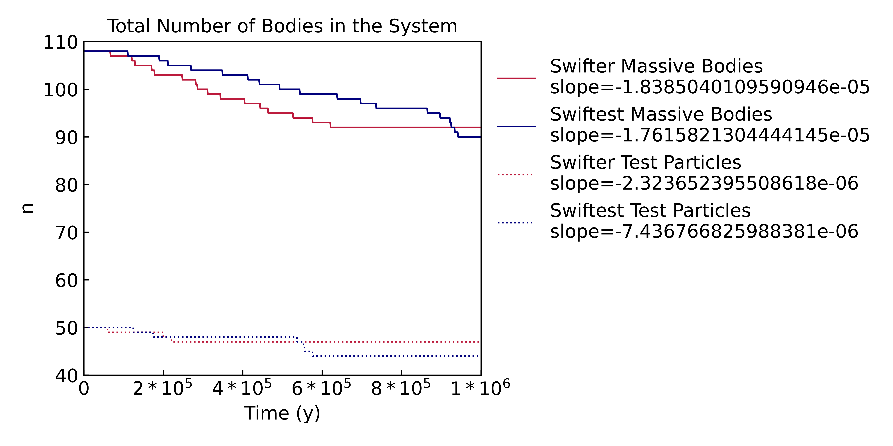
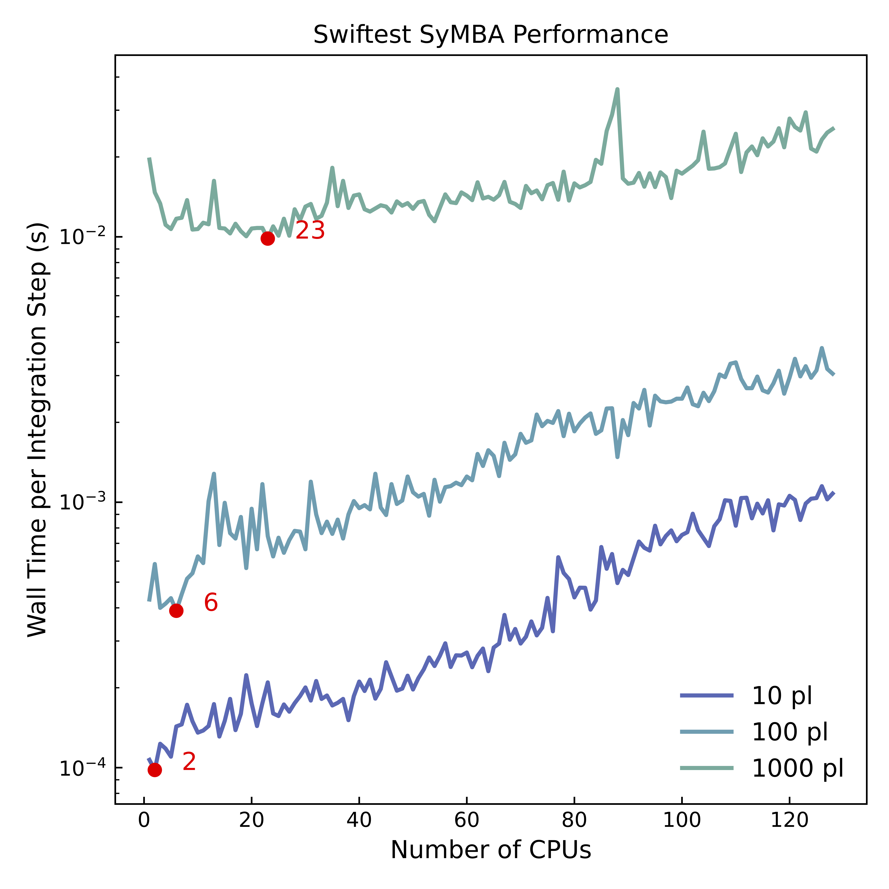

# Swiftest
### The Purdue University Swiftest Team
#### Carlisle Wishard, David Minton, Jennifer Pouplin, Jake Elliott, & Dana Singh

---

Swiftest is a software packaged designed to model the dynamical evolution of gravitational systems. Swiftest is an extension of the [Swifter](https://www.boulder.swri.edu/swifter/) software package, detailed in Duncan, Levison, and Lee (1998), that incorporates modern programming techniques and performance improvements. Swiftest contains the following numerical integrators:

- **Wisdom-Holman Mapping (WHM)** - A symplectic n-body mapping method. See [Wisdom & Holman (1991)](https://ui.adsabs.harvard.edu/abs/1991AJ....102.1528W/abstract). 
- **Regularized Mixed Variable Symplectic (RMVS)** - An extension of WHM that is capable of handling close encounters between test particles and massive bodies. See [Levison & Duncan (1994)](https://www.sciencedirect.com/science/article/pii/S0019103584710396?via%3Dihub).
- **Democratic Heliocentric (HELIO)** - A symplectic integrator that uses the democratic heliocentric coordinate frame. See [Duncan, Levison, & Lee (1998)](https://iopscience.iop.org/article/10.1086/300541).
- **Symplectic Massive Body Algorithm (SyMBA)** - An extension of HELIO that is capable of handling close encounters between massive bodies. See [Duncan, Levison, & Lee (1998)](https://iopscience.iop.org/article/10.1086/300541). 

Swiftest also includes the collisional fragmentation algorithm **Fraggle**, an addition to the SyMBA integrator. Fraggle is designed to resolve collisions between massive bodies by determining the collisional regime, derived from the work of [Leinhardt & Stewart (2012)](https://iopscience.iop.org/article/10.1088/0004-637X/745/1/79), and generating the appropriate mass distribution of fragments. Swiftest fully incorporates collisional fragments into the gravitational system, evolving these new bodies along with pre-existing bodies, including their growth and any future fragmentation events in which they are involved. 

---

#### Installation

**System Requirements**

Swiftest is designed to be downloaded, compiled, and run on a Linux based system. It is untested on Windows systems.

It is possible to download, compile, and run Swiftest on a machine with at least 400 MB of free disk space and 8 GB of RAM. To take full advantage of the parallelization and performance updates included in Swiftest, it is highly recommended that Swiftest be installed on a high-performance computing cluster. For reference, Swiftest is maintained on the Purdue University [Bell Community Cluster](https://www.rcac.purdue.edu/compute/bell). 

Swiftest is written in Modern Fortran and must be compiled using an appropriate compiler. We recommend the Intel Fortran Compiler Classic (ifort) version 19.0 or higher. For details on installing ifort, see the [Intel installation documentation](https://www.intel.com/content/www/us/en/developer/tools/oneapi/fortran-compiler.html#gs.6xhjgy). The GCC/GNU Fortran Compiler (gfortran) version 9 or higher is also compatible. For details on installing gfortran, see the [GNU Fortran documentation](https://gcc.gnu.org/wiki/GFortran).

Swiftest output files are stored in the NetCDF file format. This takes the place of the flat binary output file included in Swifter (and its predecessor [Swift](https://www.boulder.swri.edu/~hal/swift.html)). The NetCDF output format is compatible with Python, Java, and other languages that can be used to process and analyze simulation data. Details on installing NetCDF and the NetCDF Fortran Library can be found on the [Unidata website](https://docs.unidata.ucar.edu/netcdf-fortran/current/). NetCDF is built on HDF5 and it is necessary to install HDF and HDF5 as well. Details on installing HDF and HDF5 can be found on the [HDF Group website](https://www.hdfgroup.org/solutions/hdf5).

Parallelization in Swiftest is done with OpenMP. Version 3.1.4 or higher is necessary to make use of parallelization in Swiftest. If Swiftest is only to be run in serial, this package is not necessary. See the [OpenMP website](https://www.openmp.org/resources/openmp-compilers-tools/) for more details and installation instructions.

*Example of a module configuration that is necessary for compiling and running Swiftest:*
```
1. intel/19.0.5.281
2. openmpi/3.1.4
3. netcdf/4.7.4
4. netcdf-fortran/4.5.3
5. hdf/4.2.15
6. hdf5/1.10.6
```

**Downloading Swiftest**

The easiest way to get Swiftest on your machine is to clone the GitHub repository. To do so, open a terminal window and type the following:

```
$ git clone https://github.itap.purdue.edu/MintonGroup/swiftest.git
```

If your cloned version is not already set to the master branch:

```
$ git checkout master
```

To pull down any updates to Swiftest:

```
$ git pull
```

You now have a Swiftest repository on your personal machine that you may compile, edit, and run as you see fit.

**Compiling Swiftest**

Swiftest is written in modern Fortran and must be compiled before it can be run. After compilation, an executable, called the Swiftest driver, will have been created in the ```/swiftest/bin/``` directory. 

Swiftest is compiled through [CMake](https://cmake.org/). Compiling with CMake has a number of benefits that provide a streamlined experience for the Swiftest user and developer. At compilation, CMake will automatically select the set of flags that are compatible with the local compiler. CMake also allows a Swiftest developer to re-compile only the files that have been edited, instead of requiring the developer to re-compile the entire Swiftest program. Please visit the CMake website for more information on how to install CMake.

Once CMake is installed, navigate to the topmost directory in your Swiftest repository. It is best practice to create a ```build``` directory in your topmost directory from which you will compile Swiftest. This way, temporary CMake files will not clutter up the ```swiftest/src/``` sub-directories. To create a new directory and then navigate into that directory, type the following:

```
$ mkdir build
$ cd build
```

As mentioned in the **System Requirements** section, Swiftest requires the NetCDF and NetCDF Fortran libraries to be installed prior to compilation. If the libraries are installed in the standard library location on your machine, CMake should be able to find the libraries without specifying the path. However, if CMake struggles to find the NetCDF libraries, there are two ways to set the path to these libraries.

1. Create an environment variable called ```NETCDF_FORTRAN_HOME``` that contains the path to the location where the libraries are installed
2.  Set the path at the time of compilation using ```-CMAKE_PREFIX_PATH=/path/to/netcdf/```

CMake allows the user to specify a set of compiler flags to use during compilation. We define five sets of compiler flags: release, testing, profile, math, and debug. To view and/or edit the flags included in each set, see ```swiftest/cmake/Modules/SetFortranFlags.cmake```.

As a general rule, the release flags are fully optimized and best used when running Swiftest with the goal of generating results. This is the default set of flags. When making changes to the Swiftest source code, it is best to compile Swiftest using the debug set of flags. You may also define your own set of compiler flags. 

To build Swiftest with the release flags (default), type the following:
```
$ cmake ..
```
To build with the debug flags, type:
```
$ cmake .. -DCMAKE_BUILD_TYPE=DEBUG
```
To build with another set of flags, simply replace ```DEBUG``` in the above line with the name of the flags you wish to use. 

Add ```-CMAKE_PREFIX_PATH=/path/to/netcdf/``` to these commands as needed.

After building Swiftest, make the executable using: 

```
$ make
```

The Swiftest executable, called ```swiftest_driver```, should now be created in the ```/swiftest/bin/``` directory.

**Swiftest Python Package**

Included with Swiftest, in the ```/swiftest/python/swiftest/``` directory, is a Python package designed to fascilitate seamless data processing and analysis. The Python package, also called Swiftest, can be used to generate input files, run Swiftest simulations, and process output files in the NetCDF file format.

To begin, Swiftest can be added to an existing conda environment, or a new conda environment may be created, so long as the required pacakges are installed. To create and activate a new conda environment with the prerequisite packages, open a terminal and navigate to the ```/swiftest/python/swiftest/``` directory. Type the following:

```
$ conda create --name EnvName pip scipy numpy matplotlib pandas xarray jupyter astropy -y
$ conda activate EnvName
```

Next, we will install further required pacakges. Using the ```-e``` flag imports all packages in ```/swiftest/python/swiftest/requirements.txt```, including Swiftest. If the Swiftest Python package is updated in the future, using the ```-e``` flag should ensure that the user does not have to reinstall the pacakge to use the updated verison.

```
$ pip install pySLALIB
$ pip install -e . 
```

The Swiftest Python package should now be installed in the conda environment and is ready to use. If you would like to take the further step to add Swiftest to a Jupyter Notebook kernel, type the following:

```
$ ipython kernel install --user --name EnvName --display-name "Swiftest Kernel" 
```

---

#### Usage

Swiftest is built to make running a Swiftest simulation a streamlined and user friendly experience, even for a new user. As a result, Swiftest is highly flexible and a simulation can be created, run, and processed in a number of different ways. The first choice the user must make is if they would prefer ASCII input files or NetCDF input files. We recommend NetCDF input files, however we include documentation for ASCII input files for completeness.

**Brief Outline**
To create and run a Swiftest simulation using the Swiftest Python package, follow the general script below. For more details on the input files and user options, continue reading this section.

```
import swiftest                       # Import the Swiftest Python package
sim = swiftest.Simulation(**kwargs)   # Initialize a Swiftest simulation
sim.add_solar_system_body(**kwargs)   # Add any desired named Solar System bodies
sim.add_body(**kwargs)                # Add any desired user defined bodies
sim.get_parameter(**kwargs)           # View the default simulation parameters
sim.set_parameter(**kwargs)           # Set any desired simulation parameters
sim.write_param(**kwargs)             # Write simulation parameters to the param.in
sim.run(**kwargs)                     # Run the simulation (ignore if running from the terminal)
```

**NetCDF Input Files (Recommended)**

Swiftest accepts a single NetCDF input file. This file can be created using the Swiftest Python Package through a few simple steps.

To begin, simply create a new Python script in the directory you would like to store your simulation. Open the new script and import the Swiftest Python package.

```
import swiftest          
```

Next, we initialize the Swiftest simulation object. Various parameters can be provided to the simulation via key word arguments at this stage. 

```
sim = swiftest.Simulation(**kwargs)   
```

The key word arguments available to the user, along with the default values for these arguments, are as follows:

| Key Word Name                   | Key Word Description                                                                               | Options                                                                                            | Compatible Integrators |
|---------------------------------|----------------------------------------------------------------------------------------------------|----------------------------------------------------------------------------------------------------|------------------------|
|```simdir```                     | Path to subdirectory in which to store data. Default is ```/simdir```.                             | pathlike string (ex. ```path/to/directory```)                                                      | all
|```read_param```                 | Read in a pre-existing parameter input file. Default is ```False```.                               | ```True```, ```False```                                                                            | all
|```param_file```                 | Name of the pre-existing parameter input file. Only used if ```read_param``` is set to ```True```. | string (ex. ```param.in```)                                                                        | all
|```read_old_output_file```       | Read in a pre-existing simulation output file. Default is ```False```.                             | ```True```, ```False```                                                                            | all
|```codename```                   | Name of the N-body code to use. Default is ```Swiftest```.                                         | ```Swiftest```, ```Swifter```, ```Swift```                                                         | all
|```integrator```                 | Name of the N-body integrator to use. Default is ```symba```.                                      | ```symba```, ```helio```, ```rmvs```, ```whm```                                                    | all
|```t0```                         | The reference time for the start of the simulation in time units. Default is ```0.0```.            | floating point (ex. ```0.0```)                                                                     | all
|```tstart```                     | Simulation start time for a restarted run in time units. Default is ```0.0```.                     | floating point (ex. ```0.0```)                                                                     | all
|```tstop```                      | Simulation end time in time units. Must be greater than ```tstart```.                              | floating point (ex. ```100.0```)                                                                   | all
|```dt```                         | Simulation step size in time units. Must be less than or equal to ```tstop```-```tstart```.        | floating point (ex. ```0.005```)                                                                   | all
|```istep_out```                  | The number of time steps (```dt```) between output saves to memory. Either ```istep_out``` **OR** ```tstep_out``` may be set. Default is ```1```. | integer (ex. ```200```)                             | all
|```dump_cadence```               | The number of output steps between when data saved to memory is written to file. Setting to ```0``` results in writing data to file only at the completion of the simulation. Default is ```10```. | integer (ex. ```10```) | all
|```tstep_out```                  | The approximate time between when outputs saved in memory are written to file in time units. Either ```istep_out``` **OR** ```tstep_out``` may be set. | floating point (ex. ```10.0```) that calculates ```istep_out = floor(tstep_out / dt)``` | all
|```init_cond_file_type```        | Input file format. Default is ```NETCDF_DOUBLE```.                                                 | ```NETCDF_DOUBLE```, ```NETCDF_FLOAT```, ```ASCII```                                               | all
|```init_cond_file_name```        | Input file name(s). If ```init_cond_file_type``` is set to ```NETCDF_DOUBLE``` or ```NETCDF_FLOAT```, default is ```init_cond.nc```. If ```init_cond_file_type``` is set to ```ASCII```, default is a dictionary: ```{"CB" : "cb.in", "PL" : "pl.in", "TP" : "tp.in"}```. | string (ex. ```my_init_cond.nc```) or dictionary ```{"CB" : "mycb.in", "PL" : "mypl.in", "TP" : "mytp.in"}``` | all
|```init_cond_format```           | Input format. Default is ```EL```.                                                                 | ```EL```, ```XV```                                                                                 | all
|```output_file_type```           | Output file format. Default is ```NETCDF_DOUBLE```. ```REAL4```, ```REAL8```, ```XDR4```, ```XDR8``` Swifter/Swift only. | ```NETCDF_DOUBLE```, ```NETCDF_FLOAT```, ```REAL4```, ```REAL8```, ```XDR4```, ```XDR8``` | all
|```output_file_name```           | Output file name. Default is ```bin.nc```.                                                         | string (ex. ```mydata.nc```)                                                                       | all
|```output_format```              | Output format. Default is ```XVEL```.                                                              | ```XV```, ```XVEL```                                                                               | all
|```MU```                         | Mass unit system to use in the simulation. Default is ```Msun```.                                  | ```Msun```, ```Mearth```, ```kg```, ```g``` (case-insensitive)                                     | all                           
|```DU```                         | Distance unit system to use in the simulation. Default is ```AU```.                                | ```AU```, ```Rearth```, ```m```, ```cm``` (case-insensitive)                                       | all
|```TU```                         | Time unit system to use in the simulation. Default is ```Y```.                                     | ```Y```, ```YR```, ```DAY``` (Julian day), ```d``` (Julian day), ```JD``` (Julian day), ```s``` (case-insensitive) | all
|```MU2KG```                      | Mass units to kilogram conversion factor. Overrides ```MU```.                                      | floating point (ex. ```1.988409870698051e+30```)                                                   | all
|```DU2M```                       | Distance units to meters conversion factor. Overrides ```DU```.                                    | floating point (ex. ```31557600.0```)                                                              | all
|```TU2S```                       | Time units to seconds conversion factor. Overrides ```TU```.                                       | floating point (ex. ```149597870700.0```)                                                          | all
|```rmin```                       | Heliocentric distance at which a test particle is considered merged with the central body in distance units. Default is the radius of the central body in system units. | floating point (ex. ```0.3```) | all
|```rmax```                       | Heliocentric distance at which a test particle is too distant from the central body in distance units. Default is ```10000.0 AU```. | floating point (ex. ```10000.0```)                                | all
|```qmin_coord```                 | Coordinate frame used to check for minimum pericenter distance. Default is ```HELIO```.            | ```HELIO```, ```BARY```                                                                            | all
|```mtiny```                      | Mass cutoff between fully and semi-interacting massive bodies in mass units. Either ```mtiny``` **OR** ```gmtiny``` may be set. | floating point (ex. ```1e23```)                                       | all
|```gmtiny```                     | Mass cutoff between fully and semi-interacting massive bodies in gravitational mass units. Default is ```0.0```. Either ```mtiny``` **OR** ```gmtiny``` may be set. | floating point (ex. ```4e-6```)   | all
|```close_encounter_check```      | Check for close encounters. Default is ```True```. Requires radius of massive bodies to be provided in initial conditions. | ```True```, ```False```                                                    | all
|```general_relativity```         | General relativity. Default is ```True```.                                                         | ```True```, ```False```                                                                            | all
|```fragmentation```              | Resolve collisions with fragmentation. Default is ```False```.                                     | ```True```, ```False```                                                                            | SyMBA
|```minimum_fragment_gmass```     | Minimum fragment mass in gravitational mass units. Default is ```0.0```. Either ```minimum_fragment_gmass``` **OR** ```minimum_fragment_mass``` may be set. | floating point (ex. ```1e-9```)           | SyMBA
|```minimum_fragment_mass```      | Minimum fragment mass in mass units. Either ```minimum_fragment_gmass``` **OR** ```minimum_fragment_mass``` may be set. | floating point (ex. ```1e20```)                                               | SyMBA
|```rotation```                   | Rotation of massive bodies. Requires rotation vectors, radii, and moments of inertia to be provided in initial conditions. Default is ```False```. | ```True```, ```False```                            | SyMBA
|```compute_conservation_values```| Track and report the total energy, angular momentum, and mass of the system. Default is ```False```. | ```True```, ```False```                                                                          | SyMBA
|```rhill_present```              | Hill Radius present in massive body input file. Default is ```False```.                            | ```True```, ```False```                                                                            | SyMBA
|```extra_force```                | Additional user defined force routines provided. Default is ```False```.                           | ```True```, ```False```                                                                            | all
|```big_discard```                | Include data for all fully-interacting bodies (above GMTINY) in each discard. Swifter only. Default is ```False```. | ```True```, ```False```                                                           | all
|```restart```                    | If ```True```, the simulation given by ```output_file_name``` will be restarted from ```t0```.  Default is ```False```. | ```True```, ```False```                                                       | all
|```interaction_loops```          | Method for checking for interactions between bodies. Default is ```TRIANGULAR```.                  | ```TRIANGULAR```, ```FLAT```, ```ADAPTIVE```                                                       | all
|```encounter_check_loops```      | Method for checking for close encounters between bodies. Default is ```TRIANGULAR```.              | ```TRIANGULAR```, ```SORTSWEEP```, ```ADAPTIVE```                                                  | all

In the above list, the following are defined as:
- ```HELIO``` - Use the heliocentric coordinate frame.
- ```BARY``` - Use the barycentric coordinate frame.
- ```XV``` - Heliocentric position and velocity components.
- ```EL``` - Osculating orbital elements.
- ```XVEL``` - Heliocentric position and velocity components and osculating orbital elements.
- ```NETCDF_FLOAT``` - Single precision NetCDF format.
- ```NETCDF_DOUBLE``` - Double precision NetCDF format.
- ```REAL4``` - Single precision 4-byte native Fortran binary format (Swifter/Swift only)
- ```REAL8``` - Double precision 8-byte native Fortran binary format (Swifter/Swift only)
- ```XDR4``` - Single precision 4-byte XDR format (Swifter/Swift only)
- ```XDR8``` - Double precision 8-byte XDR format (Swifter/Swift only)

After creating the simulation and defining all desired parameters as keyword arguments, it is time to add bodies to the simulation. The Swiftest Python package interfaces with the [NASA JPL Horizons database](https://ssd.jpl.nasa.gov/horizons/), allowing a user to easily import the initial conditions of known solar system bodies using the ```add_solar_system_body``` method.

```
sim.add_solar_system_body(["Sun","Mercury","Venus","Earth","Mars","Jupiter","Saturn","Uranus","Neptune","Pluto"])     
```

User defined bodies can also be added to a Swiftest simulation through the Python package. Massive bodies and test particles can both be added using the ```add_body``` method. 

```
sim.add_body(**kwargs**)
```

The ```add_body``` method accepts the following keyword arguments:

| Key Word Name   | Key Word Description                                                                                                                    | Options                        |
|-----------------|-----------------------------------------------------------------------------------------------------------------------------------------|--------------------------------|
| ```name```      | Name(s) of bodies.                                                                                                                      | string or array-like of strings
| ```id```        | Unique identification value(s) of bodies.                                                                                               | float or array-like of floats
| ```a```         | Semi-major axis value(s) of bodies. Only used if  ```init_cond_format``` is set to ```EL```.                                            | float or array-like of floats
| ```e```         | Eccentricity value(s) of bodies. Only used if  ```init_cond_format``` is set to ```EL```.                                               | float or array-like of floats
| ```inc```       | Inclination value(s) of bodies. Only used if  ```init_cond_format``` is set to ```EL```.                                                | float or array-like of floats
| ```capom```     | Longitude of the ascending node value(s) of bodies. Only used if  ```init_cond_format``` is set to ```EL```.                            | float or array-like of floats
| ```omega```     | Argument of pericenter value(s) of bodies. Only used if  ```init_cond_format``` is set to ```EL```.                                     | float or array-like of floats
| ```capm```      | Mean anomaly value(s) of bodies. Only used if  ```init_cond_format``` is set to ```EL```.                                               | float or array-like of floats
| ```rh```        | Position vector(s) of bodies. Only used if  ```init_cond_format``` is set to ```XV```.                                                  | (n,3) array-like of floats
| ```vh```        | Velocity vector(s) of bodies. Only used if  ```init_cond_format``` is set to ```XV```.                                                  | (n,3) array-like of floats
| ```mass```      | Mass value(s) of bodies. Only for massive bodies. Only  ```mass``` **OR** ```Gmass``` may be set.                                       | float or array-like of floats
| ```Gmass```     | Gravitational mass value(s) of bodies. Only for massive bodies. Only  ```mass``` **OR** ```Gmass``` may be set.                         | float or array-like of floats
| ```radius```    | Radius value(s) of bodies. Only for massive bodies.                                                                                     | float or array-like of floats
| ```rhill```     | Hill Radius value(s) of bodies. Only for massive bodies.                                                                                | float or array-like of floats
| ```rot```       | Rotation rate vector(s) of bodies. Only for massive bodies. Only used if ```rotation``` is set to ```True```.                           | (n,3) array-like of floats
| ```Ip```        | Principal axes moments of inertia vector(s) of bodies. Only for massive bodies. Only used if ```rotation``` is set to ```True```.       | (n,3) array-like of floats
| ```J2```        | The J2 term of the central body.                                                                                                        | float or array-like of floats
| ```J4```        | The J4 term of the central body.                                                                                                        | float or array-like of floats

All desired bodies and parameters are added to the simulation object and the information is saved to a NetCDF input file (**<span>init_cond.nc</span>**) and an ASCII parameter file (**<span>param.in</span>**) automatically. The parameter file is not necessary to run a Swiftest simulation, it is simply a convenient reference for the user. These files are stored in the ```/simdata``` subdirectory.

**ASCII Input Files**
Swiftest accepts 4 ASCII input files. All four input files are necessary, however the structure of each input file varies slightly depending on the features and capabilities of the integrator selected. For examples of Swiftest input files, see the examples section. The four input files are as follows:

- **<span>param.in</span>** - The parameter input file.
- **<span>cb.in</span>** - The central body input file.
- **<span>pl.in</span>** - The massive body input file.
- **<span>tp.in</span>** - The test particle input file.

The parameter options used in the **<span>param.in</span>** are as follows:

| Parameter Name          | Parameter Description                                                                                                        | Input Format                                                                                            | Compatible Integrators |
|-------------------------|------------------------------------------------------------------------------------------------------------------------------|---------------------------------------------------------------------------------------------------------|------------------------|
| ```T0```                | The reference time for the start of the simulation in time units.                                                            | floating point (ex. ```0.0```)                                                                          | all
| ```TSTART```            | Simulation start time for a restarted run in time units.                                                                     | floating point (ex. ```0.0```)                                                                          | all
| ```TSTOP```             | Simulation end time in time units. Must be greater than ```TSTART```.                                                        | floating point (ex. ```100.0```)                                                                        | all
| ```DT```                | Simulation step size in time units. Must be less than or equal to ```TSTOP```-```TSTART```.                                  | floating point (ex. ```0.005```)                                                                        | all
| ```ISTEP_OUT```         | The number of time steps (```DT```) between output saves to memory.                                                          | integer (ex. ```200```)                                                                                 | all
| ```DUMP_CADENCE```      | The number of output steps between when data saved to memory is written to file. Setting to ```0``` results in writing data to file only at the completion of the simulation. | integer (ex. ```100```)                                | all
| ```IN_TYPE```           | Input file format.                                                                                                           | ```ASCII```, ```NETCDF_FLOAT```, and ```NETCDF_DOUBLE```                                                | all
| ```NC_IN```             | NetCDF input file name. Only if ```IN_TYPE``` is set to ```NETCDF_FLOAT``` or ```NETCDF_DOUBLE```.                           | string (ex. ```init_cond.nc```)                                                                         | all   
| ```PL_IN```             | Massive body input file name. Only if ```IN_TYPE``` is set to ```ASCII```.                                                   | string (ex. ```pl.in```)                                                                                | all
| ```TP_IN```             | Test particle input file name. Only if ```IN_TYPE``` is set to ```ASCII```.                                                  | string (ex. ```tp.in```)                                                                                | all
| ```CB_IN ```            | Central body input file name. Only if ```IN_TYPE``` is set to ```ASCII```.                                                   | string (ex. ```cb.in```)                                                                                | all
| ```IN_FORM```           | Input format.                                                                                                                | ```EL```, ```XV```                                                                                      | all
| ```OUT_TYPE```          | Output file format.                                                                                                          | ```NETCDF_FLOAT```, ```NETCDF_DOUBLE```                                                                 | all
| ```BIN_OUT```           | Output file name.                                                                                                            | string (ex. ```bin.nc```)                                                                               | all
| ```OUT_FORM```          | Output format.                                                                                                               | ```XV```, ```XVEL```                                                                                    | all
| ```OUT_STAT```          | Output status.                                                                                                               | ```NEW```, ```APPEND```, ```REPLACE```, ```UNKNOWN```                                                   | all
| ```CHK_QMIN```          | Pericenter distance at which a test particle is too close to the pericenter of the system in distance units.                 | floating point, turn off using ```-1.0```                                                               | all
| ```CHK_RMIN```          | Heliocentric distance at which a test particle is considered merged with the central body in distance units.                 | floating point, turn off using ```-1.0```                                                               | all
| ```CHK_RMAX```          | Heliocentric distance at which a test particle is too distant from the central body in distance units.                       | floating point (ex. ```1000.0```)                                                                       | all
| ```CHK_EJECT```         | Heliocentric distance at which an unbound test particle is too distant from the central body in distance units.              | floating point (ex. ```1000.0```)                                                                       | all
| ```CHK_QMIN_COORD```    | Coordinate frame used to check for minimum pericenter distance.                                                              | ```HELIO```, ```BARY```                                                                                 | all
| ```CHK_QMIN_RANGE```    | Upper and lower bounds of the semimajor axis range used to check the pericenter distance.                                    | two floating points, turn off using ```-1.0 -1.0```                                                     | all
| ```EXTRA_FORCE```       | Additional user defined force routines provided.                                                                             | ```YES```, ```NO```                                                                                     | all
| ```CHK_CLOSE```         | Check for close encounters. Requires radius of massive bodies to be provided in initial conditions.                          | ```YES```, ```NO```                                                                                     | all
| ```INTERACTION_LOOPS``` | Method for checking for interactions between bodies.                                                                         | ```TRIANGULAR```, ```FLAT```, ```ADAPTIVE```                                                            | all
| ```ENCOUNTER_CHECK```   | Method for checking for close encounters between bodies.                                                                     | ```TRIANGULAR```, ```SORTSWEEP```, ```ADAPTIVE```                                                       | all
| ```MU2KG```             | Mass units to kilogram conversion factor.                                                                                    | floating point (ex. ```1.988409870698051e+30```)                                                        | all
| ```TU2S```              | Time units to seconds conversion factor.                                                                                     | floating point (ex. ```31557600.0```)                                                                   | all
| ```DU2M```              | Distance units to meters conversion factor.                                                                                  | floating point (ex. ```149597870700.0```)                                                               | all
| ```BIG_DISCARD```       | Include data for all fully-interacting bodies (above GMTINY) in each discard. Swifter only.                                  | ```YES```, ```NO```                                                                                     | all
| ```GR```                | General relativity.                                                                                                          | ```YES```, ```NO```                                                                                     | all
| ```RHILL_PRESENT```     | Hill Radius present in massive body input file.                                                                              | ```YES```, ```NO```                                                                                     | SyMBA
| ```ENERGY```            | Track and report the total energy, angular momentum, and mass of the system.                                                 | ```YES```, ```NO```                                                                                     | SyMBA
| ```FRAGMENTATION```     | Resolve collisions with fragmentation.                                                                                       | ```YES```, ```NO```                                                                                     | SyMBA
| ```ROTATION```          | Rotation of massive bodies. Requires rotation vectors, radii, and moments of inertia to be provided in initial conditions.   | ```YES```, ```NO```                                                                                     | SyMBA
| ```GMTINY```            | Mass cutoff between fully and semi-interacting massive bodies in gravitational mass units.                                   | floating point (ex. ```4e-06```)                                                                        | SyMBA
| ```MIN_GMFRAG```        | Minimum fragment mass in gravitational mass units.                                                                           | floating point (ex. ```1e-09```)                                                                        | SyMBA
| ```TIDES```             | Tidal dissipation model.                                                                                                     | ```YES```, ```NO```                                                                                     | *(under development)*
| ```YORP```              | YORP effect.                                                                                                                 | ```YES```, ```NO```                                                                                     | *(under development)*
| ```YARKOVSKY```         | Yarkovsky effect.                                                                                                            | ```YES```, ```NO```                                                                                     | *(under development)*

In the above list, the following are defined as:
- ```HELIO``` - Use the heliocentric coordinate frame for ```CHK_QMIN```
- ```BARY``` - Use the barycentric coordinate frame for ```CHK_QMIN```
- ```XV``` - Heliocentric position and velocity components for ```IN_FORM``` and/or ```OUT_FORM```
- ```EL``` - Osculating orbital elements for ```IN_FORM``` and/or ```OUT_FORM```
- ```XVEL``` - Heliocentric position and velocity components and osculating orbital elements for ```OUT_FORM```
- ```NETCDF_FLOAT``` - Single precision NetCDF format for ```OUT_TYPE```
- ```NETCDF_DOUBLE``` - Double precision NetCDF format for ```OUT_TYPE```

For more details on the ```INTERACTION_LOOPS``` and ```ENCOUNTER_CHECK``` options, see the **Updates to Swifter SyMBA** section below.

The **<span>cb.in</span>** includes all central body initial conditions. The structure of the **<span>cb.in</span>** is as follows:

```
0                 ! ID number
1.0               ! Gravitational mass (G*mass) in mass units (ex. 39.47841760435743 for Sun in M_sun/AU/year)
1.0               ! Central body radius is distance units (ex. 0.004650467260962157 for Sun in AU)
0.0               ! J2 term, optional, set to 0.0 for a spherical body
0.0               ! J4 term, optional, set to 0.0 for a spherical body
0.4 0.4 0.4       ! Principal moments of inertia, optional, leave off if not using, SyMBA only
0.0 0.0 0.0       ! Rotational vectors in radians per second, optional, leave off if not using, SyMBA only
```

The **<span>pl.in</span>** includes all massive body initial conditions. The structure of the  **<span>pl.in</span>** is as follows:

```
2                 ! Total number of massive bodies
1, 0.0, 0.0       ! ID number, Gravitational mass (G*mass) in mass units, Hill Radius in distance units if RHILL_PRESENT is set to YES, leave off if not using
0.0               ! Radius is distance units if CHK_CLOSE is set to YES, leave off if not using
1.0 1.0 1.0       ! If IN_FORM is set to XV then this is the heliocentric position vector, if it is set to EL then this is the semi-major axis, the eccentricity, and the inclination
1.0 1.0 1.0       ! If IN_FORM is set to XV then this is the heliocentric velocity vector, if it is set to EL then this is the longitude of the ascending node, the argument of pericenter, and the mean anomaly
0.4 0.4 0.4       ! Principal moments of inertia, optional, leave off if not using, SyMBA only
1.0 1.0 1.0       ! Rotational vectors in radians per second, optional, leave off if not using, SyMBA only
2, 0.0, 0.0       
0.0               
1.0 1.0 1.0       
1.0 1.0 1.0       
0.4 0.4 0.4       
1.0 1.0 1.0        
```

The **<span>tp.in</span>** includes all test particle initial conditions. In the event that no test particles are desired, the **<span>tp.in</span>** must still be included, however it can simply contain a single ```0```. The structure of the **<span>tp.in</span>** is as follows:

```
2                 ! Total number of test particles 
3                 ! ID number
1.0 1.0 1.0       ! If IN_FORM is set to XV then this is the heliocentric position vector, if it is set to EL then this is the semi-major axis, the eccentricity, and the inclination
1.0 1.0 1.0       ! If IN_FORM is set to XV then this is the heliocentric velocity vector, if it is set to EL then this is the longitude of the ascending node, the argument of pericenter, and the mean anomaly
4                 
1.0 1.0 1.0       
1.0 1.0 1.0       
```

Note that the ID numbers of the test particles are a continuation of the ID numbers of the massive bodies. No two bodies in the system can have the same ID number. 

**Running a Swiftest Simulation**

The input files necessary to successfully run Swiftest should now be generated in the simulation directory. The user is now faced with a second choice: to run a Swiftest simulation from a Python environment (recommended) or to run it directly from the terminal. Either option is possible with NetCDF format input files, however ASCII input files must be run directly from the terminal.

**Running via Python**

To run a Swiftest simulation from the same script in which the initial conditions are created, simply add the following line after you have finished defining parameters and adding bodies to the simulation:

```
sim.run()
```

To run a previously created set of initial conditions, first read the old output file into Python, and then run it. Note that Swiftest will look in the ```/simdata``` subdirectory for the initial conditions by default. You may set a new path to the initial conditions using the ```param_file``` keyword argument.

```
sim = swiftest.Simulation(read_param=True, param_file='path/to/param.in')
sim.run()
```

**Running via a Terminal**

When creating a new Swiftest simulation, ensure that all required input files exist in a unique directory. A symbolic link to the Swiftest driver should also exist in the simulation directory. To create a symbolic link to the Swiftest driver from your current directory, type:

```
$ ln -s ~/PATH/TO/swiftest/bin/swiftest_driver .
```

To run Swiftest, simply type the following command into the terminal:

```
$ ./swiftest_driver INTEGRATOR param.in
```

Where ```INTEGRATOR``` is your integrator of choice, either ```whm```, ```rmvs```, ```helio```, or ```symba```.

**Outputs**

Swiftest generates between 1 and 6 output files, depending on the input parameters selected and the method through which Swiftest was run. The output files are as follows:
- **<span>bin.nc</span>** - Always generated, the output file containing the information for every body in the system, recorded every ```ISTEP_OUT``` timesteps and written every ```DUMP_CADENCE```.
- **fraggle.log** - The log containing the record of each fragmentation event, including the properties of the colliding bodies, the collisional regime, and the properties of the fragments created, only if ```FRAGMENTATION``` is ```YES```, Swiftest SyMBA only, ASCII file format only
- **encounter_check_plpl_timer.log** - The log containing the encounter check timer for each massive body/massive body encounter,  only if ```CHK_CLOSE```/```close_encounter_check``` is ```YES```/```True``` and ```ENCOUNTER_CHECK```/```encounter_check_loops``` is ```ADAPTIVE```, ASCII file format only
- **encounter_check_pltp_time.log** - The log containing the encounter check timer for each massive body/test particle encounter, only if ```CHK_CLOSE```/```close_encounter_check``` is ```YES```/```True``` and ```ENCOUNTER_CHECK```/```encounter_check_loops``` is ```ADAPTIVE```, ASCII file format only
- **interaction_timer.log** - The log containing the interaction loop timer for each interacting pair of bodies, only if ```INTERACTION_LOOPS``` is ```ADAPTIVE```, ASCII file format only
- **swiftest.log** - A log containing the input parameters and a brief updated on the status of the run. Only generated if Swiftest is run through the Python package. If Swiftest is run through the terminal, these updates are output directly to the terminal.

Regardless of whether the status outputs are recorded in the **swiftest.log** or in the terminal, the output format is the same. Below is an example of a single status output:

``````
Time =  1.00000E+03; fraction done =  0.001; Number of active plm, pl, tp =    57,   108,    50
  DL/L0 =  6.83763E-12; DEcollisions/|E0| =  0.00000E+00; D(Eorbit+Ecollisions)/|E0| =  2.65579E-03; DM/M0 =  0.00000E+00
Integration steps: Total wall time:  2.99848E+02; Interval wall time:  9.36192E+01;Interval wall time/step:   4.68956E-04
``````

The first line includes the simulation time, the fraction of the simulation that is complete relative to ```tstop```, the number of fully-interactive massive bodies (```plm```) (SyMBA only), the total number of massive bodies (```pl```) including fully-interactive and semi-interactive bodies, and the number of test particles (```tp```) remaining in the system at that time. The second line includes the angular momentum error, the change in energy as a result of collisions only, the total change in energy, and the change in mass up to this point in the simulation (error analysis included only if ```ENERGY```/```compute_conservation_values``` is set to ```YES```/```True```). The third line contains the total wall time elapsed since the start of the simulation, the wall time elapsed since the start of the last step, and the average wall time per step since the start of the simulation.

**Restarting a Simulation From t $\neq$ 0**

Just like Swiftest allows the user to run a simulation through the terminal or through Python, Swiftest also allows the user to restart a simulation from t $\neq$ 0 in the same two manners. This can be useful in the case of an accidental termination of a simulation, such as through a power outage or computer failure. In many cases, it is also necessary to run a simulation to a new end point, past the original ```TSTOP```.

**Restarting via Python**

To restart a Swiftest simulation via the Swiftest Python package, follow the outline below:

```
import swiftest
sim = swiftest.Simulation(read_param=True, param_file='path/to/param.in')
sim.set_parameter(tstop=VAL)  # Set a new stop time
sim.write_param()             # Write simulation parameters to the param.in
sim.run()
```

Note that Swiftest will look in the ```/simdata``` subdirectory for the initial conditions by default. You may set a new path to the initial conditions using the ```param_file``` keyword argument.

**Restarting via a Terminal**

Every ```DUMP_CADENCE``` X ```ISTEP_OUT``` timesteps, Swiftest writes all simulation information from memory to the output files. At the same time, Swiftest also writes all simulation information to one of two sets of dump files, alternating between sets at each subsequent dump. This way, even if Swiftest is terminated during the writing stage, at least one set of dump files is preserved and the information is not lost. When Swiftest is restarted from a dump file, it automatically determines which set of dump files has proceeded further in simulation time, and picks up from that point. 

The Dump Files:
- **dump_param1.in** - The file storing all simulation parameters for set 1 of the dump files, ASCII file format only
- **dump_param2.in** - The file storing all simulation parameters for set 2 of the dump files, ASCII file format only
- **dump_bin1.nc** or **dump_bin1.dat** - The file storing all simulation information for set 1 of the dump files, NetCDF file format 
- **dump_bin2.nc** or **dump_bin2.dat** - The file storing all simulation information for set 2 of the dump files, NetCDF file format 

To restart Swiftest from a dump file, simply follow the instructions detailed in the **Running via a Terminal** section, replacing ```PARAM``` with either **dump_param1.in** or **dump_param2.in**. The option of specifying **dump_param1.in** or **dump_param2.in** is included for backwards compatibility. Swiftest will still automatically check which dump file has progressed further and select that dump file, regardless of your choice of dump parameter file. If you would like to force Swiftest to select one dump parameter file over the other, simply delete the set of dump files that you do not want. 

---

**NOTHING IS CHECKED BELOW HERE**
#### Updates to Swifter Included in Swiftest

**Fraggle**

To activate the Fraggle algorithm, set ```FRAGMENTATION``` in the **<span>param.in</span>** to ```YES```. When resolving a close encounter that results in a collision, Fraggle determines the regime of the collision as well as the mass, number, position, velocity, and rotation of all resulting bodies. This is distinct from Swiftest SyMBA's predecessor, Swifter SyMBA, which assumes that all collisions result in perfect mergers. 

Fraggle distinguishes the following collisional regimes: (1) perfect merging, which includes the cratering, partial accretion, and graze-and-merge regimes of Leinhardt & Stewart 2012, (2) disruption, which includes the partial erosion regime of Leinhardt & Stewart 2012, (3) super-catastrophic disruption, and (4) hit-and-run events which can be either ‘pure’ or ‘disruptive’. For more details on the collisional regimes used in Fraggle, please see Wishard et al. 2023 (in preparation). 

For every collision throughout the course of a simulation, Fraggle writes all details of the collision to the **fraggle.log** output file. An example of a collision, stored in the **fraggle.log** output file, is as follows:

```
Fraggle logfile

 **********************************************************************************************************************
 Collision between massive bodies detected at time t = 53287.8837501905
 **********************************************************************************************************************

 --------------------------------------------------------------------
            Fraggle collisional regime determination results
 --------------------------------------------------------------------
 ----------------------- Collider information -----------------------
 True number of colliders :            2             
 Index list of true colliders  :           46          59
 -------------------- Two-body equivalent values ---------------------
 mass1    :   7.279963439341357E-008
 radius1  :   1.509673399450197E-005
 xb1      :  -0.164526979999547       0.274220676062862      -1.874872430483121E-003
 vb1      :   -10.3604371489563       -6.86832326672301       0.784240412278650
 rot1     :   0.000000000000000E+000  0.000000000000000E+000  0.000000000000000E+000
 Ip1      :   0.400000000000000       0.400000000000000       0.400000000000000
 L_spin1  :   0.000000000000000E+000  0.000000000000000E+000  0.000000000000000E+000
 L_orbit1 :   2.025082559023084E-013 -4.805611941169830E-014  8.130853354510135E-014
 mass2    :   3.639981719670679E-008
 radius2  :   1.198228571207825E-005
 xb2      :  -0.164537935569248       0.274203936567747      -1.857479937042359E-003
 vb2      :   -9.62196685949397       -6.65749989216304      -0.930400979141005
 rot2     :   0.000000000000000E+000  0.000000000000000E+000  0.000000000000000E+000
 Ip2      :   0.400000000000000       0.400000000000000       0.400000000000000
 L_spin2  :   0.000000000000000E+000  0.000000000000000E+000  0.000000000000000E+000
 L_orbit2 :   4.050165118023079E-013 -9.611223882570558E-014  1.626170670889251E-013
 ------------------------------ Regime -----------------------------
 Supercatastrophic disruption
 ----------------------- Fragment information ----------------------
 Total mass of fragments      :   1.091994515901204E-007
 Largest fragment mass        :   6.712252746514322E-009
 Second-largest fragment mass :   2.697031548515946E-009
 Remaining fragment mass      :   9.979016729509007E-008
 Center of mass position      :  -0.164530631856114       0.274215096231157      -1.869074932669534E-003
 Center of mass velocity      :   -10.1142803858022       -6.79804880853635       0.212693281805431
 Energy loss                  :   4.042796382680678E-021
 --------------------------------------------------------------------
 Supercatastrophic disruption between Embryo_108 (17) and Planetesimal_165 (74)
 Fraggle generating 25 fragments.
 Fraggle try 1
 Fraggle failed due to high energy error: 2.228292487416184E-006   222.829248791199
 Fraggle try 1
 Fraggle fragment generation succeeded after 2 tries

 --------------------------------------------------------------------
            Fraggle fragment generation results
 --------------------------------------------------------------------
 dL_tot should be very small
 dL_tot      | 4.7581E-18
 dE_tot should be negative and equal to Qloss
 dE_tot      |-6.4291E-16
 Qloss       |-1.4019E-18
 dE - Qloss  |-6.4151E-16
 -------------------------------------------------------------------------------------
 Individual fragment values (collisional system natural units)
 mass
           1  6.146782468934672E-002
            ...
          25  9.385003231486798E-003
 x_coll
           1  0.316962058114018      -3.455343819627035E-002 -0.300006155462737
            ...
          25 -0.815265667032389       0.366308046064501       -2.21749663921913
 v_coll
           1  5.313828153210731E-002 -4.301810302840381E-003 -4.677161223686286E-002
            ...
          25 -6.377609897296144E-002  6.344417215259035E-002 -0.181654563778228
 xb
           1  -6075.62794432757        10126.4434063427       -69.3229971249382
            ...
          25  -6076.76017205272        10126.8442678270       -71.2404876086946
 vb
           1  -1.11732916805166      -0.791000868225230      -2.215784303111038E-002
            ...
          25  -1.23424354855673      -0.723254885769800      -0.157040794572475
 rot
           1  1.524406714701067E-002 -3.617486407307866E-003  6.120533573657602E-003
            ...
          25  0.349507539640067      -8.293972741700310E-002  0.140328208343859
 Generating 25 fragments

 --------------------------------------------------------------------
            Fraggle fragment final body properties
 --------------------------------------------------------------------
  id, name
           1         159                   Newbody0000159
            ...
          25         183                   Newbody0000183
 mass, Gmass
           1  6.712252746514322E-009  2.649791077120669E-007
            ...
          25  1.024837206049866E-009  4.045742296433080E-008
 radius
           1  6.820183146057143E-006
            ...
          25  3.645229682479472E-006
 xb
           1 -0.164522048834296       0.274214160557923      -1.877198805265405E-003
            ...
          25 -0.164552708451177       0.274225015493955      -1.929122567862225E-003
 vb
           1  -9.65510018491191       -6.83522174793328      -0.191471054783233
            ...
          25  -10.6653844315872       -6.24981301930138       -1.35702588643539
 xh
           1 -0.163736684665089       0.275484908115360      -1.873622658345619E-003
            ...
          25 -0.163767344281971       0.275495763051392      -1.925546420942439E-003
vh
           1  -9.65588432804781       -6.83327438044371      -0.191474942854245
            ...
          25  -10.6661685747231       -6.24786565181180       -1.35702977450640
 rot
           1   4864.55998519625       -1154.38219041380        1953.13379450074
            ...
          25   111531.940620641       -26467.0363417388        44780.3713090889
 Ip
           1  0.400000000000000       0.400000000000000       0.400000000000000
            ...
          25  0.400000000000000       0.400000000000000       0.400000000000000
```

**General Relativity**

From its observation in the mid-1800s to the development of the theory of general relativity by Albert Einstein in 1915, the precession of Mercury's perihelion puzzled scientists and observers. Mercury's orbit precesses by approximately $42.980 \pm 0.001$ arcseconds / century more than is expected from Newtonian mechanics. This deviation can be explained by the curvature of spacetime due to the mass of the Sun. Mercury's close proximity to the Sun enhances the effects of general relativity, providing a good test case to highlight the functionality of general relativity in Swiftest. 

In this test case, we track the orbit of Mercury for 1000 years as it orbits around the Sun in the presence of the seven other massive planets. The precession rate of the longitude of periapsis of Mercury, as calculated by Swiftest SyMBA, differs by only $\sim 0.0286 \%$ from the precession rate calculated from the NASA JPL Horizons database.

||
|:--:|
|**Figure 1** - The longitude of periapsis of Mercury over 1000 years, as calculated by Swifter SyMBA (dotted green), Swiftest SyMBA with general relativity turned off (long dashed yellow), and Swiftest SyMBA with general relativity turned on (short dashed blue). These results are compared to the periapsis of Mercury as calculated from the NASA JPL Horizons database (solid red). Swiftest SyMBA with general relativity turned off is in good agreement with Swifter SyMBA ($\sim 0.00053 \%$ difference), while Swiftest SyMBA with general relativity turned on is in good agreement with the NASA JPL Horizons database ($\sim 0.0286 \%$ difference).| 

**Adaptive Interaction Calculations and Encounter Checking**

In Swifter SyMBA, gravitational interactions between bodies are calculated on a pair-by-pair basis by solving an upper triangular matrix. In practice, this is done through a double loop. While effective, solving a triangular matrix is computationally costly and it is considered best practice to avoid nested loops wherever possible. Swiftest SyMBA offers an alternative to this method, allowing the user to choose between calculating the gravitational interactions between bodies through a traditional triangular matrix or through a flattened Euclidean distance matrix.

A Euclidean distance matrix is a two-dimensional array that stores the distance between each pairing of points in a set of elements. For more details on the algorithm implemented in Swiftest to flatten the Euclidean distance matrix, please see [Angeletti, Bonny, & Koko 2019](https://hal.archives-ouvertes.fr/hal-02047514).

Along with allowing the user to choose whether the gravitational interactions are calculated through an upper triangular matrix or a flattened Euclidean distance matrix, Swiftest SyMBA allows the user to let the program determine the speedier solution. Through adaptive interaction calculations, Swiftest SyMBA periodically tracks the time it takes to complete an interaction calculation using both the triangular and flat methods. Whichever method proves to be quicker is implemented until the next time both methods are tested. Swiftest SyMBA periodically checks the performance of each method, possibly switching between the two methods multiple times over the course of a simulation. By selecting adaptive interaction calculations, the user allows Swiftest SyMBA to optimize its own performance and adapt to changes in the number of particle pairings as the simulation progresses.

An example of the adaptive interaction calculations, stored in the **interaction_timer.log** output file, is as follows:

```
Interaction loop timer logfile                                                ! The file header
Diagnostic values: loop style, time count, nplpl, metric                      ! The diagnostic values used to determine which calculation method is fastest
symba_kick_getacch_int_pl: loop timer turned on at t = 0.000000000000000E+000 ! The subroutine in which the timing is being conducted and the time (in simulation time) at which the timer is begun
symba_kick_getacch_int_pl: stage 1                                            ! Begins timing the first method
FLAT        95 7353 1.291989664082687E-002                                    ! The calculation method type, the time (in seconds) to calculate all interactions, the number of massive body / massive body interactions, and the time per interaction (time / number of interactions)
symba_kick_getacch_int_pl: stage 2                                            ! Begins timing the second method
TRIANGULAR  100 7353 1.359989120087039E-002                                   ! The calculation method type, the time (in seconds) to calculate all interactions, the number of massive body / massive body interactions, and the time per interaction (time / number of interactions)
symba_kick_getacch_int_pl: the fastest loop method tested is FLAT             ! The subroutine in which the timing is being conducted and which interaction calculation method is determined to be fastest
```

In addition to calculating the gravitational interactions between pairings of bodies, Swifter SyMBA also uses an upper triangular matrix to check if pairings of bodies are in a close encounter state. While similar to interaction calculations, encounter checking can be further simplified to exclude pairs of bodies which, based on their physical distance, are unlikely to be in an encounter state. To address this, Swiftest SyMBA offers an alternative to solving an upper triangular matrix through the sort and sweep method.

The sort and sweep method of collision detection (see [Ericson 2005](https://www.sciencedirect.com/book/9781558607323/real-time-collision-detection) for more details), also known as the sweep and prune method, is a way of limiting the number of pairs of bodies that need to be checked for a collision in each time step. At the start of a new time step, the position of each body is calculated and the critical radius of each body is determined. The critical radius is based on the radius of a body's Hill sphere. The distance from a body's center to the extent of its critical radius defines the encounter sphere of the body. The position of the center of mass of the body and the extent of its encounter sphere are used to define the bounding box used in the sort and sweep algorithm. Based on the defined bounding box, the positions of the lower and upper bounds of all of the bodies in the simulation are compiled into sorted lists. Because each body is unlikely to move significantly between time steps, updating these sorted lists each time step is relatively straightforward. Only when the bounding boxes of two bodies overlap in all axes are the bodies flagged as an encountering pair. 

The sort and sweep algorithm is computationally efficient because it limits the number of potential encountering pairs that must be checked for encounters. For example, by calculating the bounding boxes of two bodies on opposite sides of the solar system, the algorithm then sorts the upper and lower bounds of these two bounding boxes into opposite ends of a sorted list. Through this sorting, the algorithm recognizes that these two bodies are unlikely to encounter one another in the following time step and is able to quickly exclude them from more extensive encounter checking, saving time and computational resources.  
In the same way that the user can allow Swiftest SyMBA to adapt when calculating the gravitational interactions between bodies, the user can also allow Swiftest SyMBA to determine the faster method of encounter checking. Just as Swiftest SyMBA periodically tests the interaction calculation methods, it also periodically tests the encounter checking methods. The quicker of the two methods is selected and implemented, allowing Swiftest SyMBA to adapt to changes in the distribution of bodies in the system as the simulation progresses.

An example of the adaptive encounter checking, stored in the **encounter_check_plpl_timer.log** output file, is as follows:

```
Encounter check loop timer logfile                                           ! The file header
Diagnostic values: loop style, time count, nplpl, metric                     ! The diagnostic values used to determine which checking method is fastest
encounter_check_all_plpl: loop timer turned on at t = 5.000000000000000E-003 ! The subroutine in which the timing is being conducted and the time (in simulation time) at which the timer is begun
encounter_check_all_plpl: stage 1                                            ! Begins timing the first method
SORTSWEEP   196 7353 2.665578675370597E-002                                  ! The checking method type, the time (in seconds) to check all possible encounters, the number of possible massive body / massive body encounters, and the time per encounter (time / number of possible encounters)
encounter_check_all_plpl: stage 2                                            ! Begins timing the second method
TRIANGULAR  164 7353 2.230382156942744E-002                                  ! The checking method type, the time (in seconds) to check all possible encounters, the number of possible massive body / massive body encounters, and the time per encounter (time / number of possible encounters)
encounter_check_all_plpl: the fastest loop method tested is TRIANGULAR       ! The subroutine in which the timing is being conducted and which encounter checking method is determined to be fastest
```

Together, adaptive interaction calculations and encounter checking are idea for lengthy simulations with a large number of particles. The flexibility of Swiftest SyMBA ensures that the parameters of the integration are optimized for each individual simulation, even as the simulation evolves. 

**NetCDF Compatability**

The NetCDF (Network Common Data Form) file format is a cross-platform method of creating, accessing, and sharing data. Due to its self-describing nature, NetCDF is ideal for archiving multidimensional scientific data. NetCDF files are also appendable, allowing for data to be added to a file after creation, making the NetCDF file format well suited for handling simulation output. NetCDF is maintained by the University Corporation for Atmospheric Research (UCAR) and is a standard file format across much of the atmospheric modeling community. 

In Swifter SyMBA, simulation outputs were stored in a flat binary file. These binary files could only be easily accessed through [SwiftVis](https://cs.trinity.edu/~mlewis/SwiftVis/), a data analysis and visualization software package designed to process Swifter data. In accordance with modern data management practices and industry standards, Swiftest incorporates a NetCDF output file format for all simulation types. NetCDF is compatible with many of today's most widely-used programming languages including Fortran, Python, Java, C++, and more. By writing simulation data to a NetCDF output file, Swiftest provides the user with the flexibility to analyze and visualize data in any language they choose. The NetCDF file format is also adaptable such that any future additions to Swiftest can be seamlessly incorporated into the output file. 


To read in a Swiftest output file, create a new Python script in the simulation directory. We recommend using [Xarray](https://docs.xarray.dev/en/stable/index.html) to manage and process output files.

```
import swiftest                                             # Importing Swiftest
import xarray as xr                                         # Importing Xarray
ds = swiftest.Simulation(param_file="PATH/TO/param.in").ds  # Storing all simulation data to an Xarray dataset.
```

All Swiftest data is now stored in the Xarray dataset ```ds``` and is easily processed, manipulated, and analyzed. The NetCDF output file stores data in two dimensions: simulation time (```time```) and particle ID (```id```). The NetCDF output file contains a maximum of 60 data variables. Below is a list of all data variables and their associated dimension.

| Data Variable Name     | Data Variable Description                                                                                                                                  | Data Variable Dimension | 
|------------------------|------------------------------------------------------------------------------------------------------------------------------------------------------------|-------------------------|
| ```npl```              | Number of massive bodies                                                                                                                                   | time                    | 
| ```ntp```              | Number of test particles                                                                                                                                   | time                    | 
| ```nplm```              | Number of massive bodies above the ```GMTINY``` cutoff value                                                                                                                                   | time                    | 
| ```name```             | Name of particle                                                                                                                                           | id                      | 
| ```particle_type```    | Particle type (Central Body, Massive Body, or Test Particle)                                                                                               | id                      | 
| ```status```           | Particle status (Active, collisional regime, discard fate etc.)                                                                                            | id                      |
| ```xhx```              | Heliocentric x-coordinate of position in distance units, only if ```OUT_FORM``` in the **<span>param.in</span>** is set to ```XV``` or ```XVEL```          | time, id                |
| ```xhy```              | Heliocentric y-coordinate of position in distance units, only if ```OUT_FORM``` in the **<span>param.in</span>** is set to ```XV``` or ```XVEL```          | time, id                |
| ```xhz```              | Heliocentric z-coordinate of position in distance units, only if ```OUT_FORM``` in the **<span>param.in</span>** is set to ```XV``` or ```XVEL```          | time, id                |
| ```vhx```              | Heliocentric x-coordinate of velocity in distance and time units, only if ```OUT_FORM``` in the **<span>param.in</span>** is set to ```XV``` or ```XVEL``` | time, id                |
| ```vhy```              | Heliocentric y-coordinate of velocity in distance and time units, only if ```OUT_FORM``` in the **<span>param.in</span>** is set to ```XV``` or ```XVEL``` | time, id                | 
| ```vhz```              | Heliocentric z-coordinate of velocity in distance and time units, only if ```OUT_FORM``` in the **<span>param.in</span>** is set to ```XV``` or ```XVEL``` | time, id                |
| ```a```                | Semi-major axis in distance units, only if ```OUT_FORM``` in the **<span>param.in</span>** is set to ```EL``` or ```XVEL```                                | time, id                | 
| ```e```                | Eccentricity, only if ```OUT_FORM``` in the **<span>param.in</span>** is set to ```EL``` or ```XVEL```                                                     | time, id                |
| ```inc```              | Inclination in degrees, only if ```OUT_FORM``` in the **<span>param.in</span>** is set to ```EL``` or ```XVEL```                                           | time, id                | 
| ```capom```            | Longitude of ascending node, only if ```OUT_FORM``` in the **<span>param.in</span>** is set to ```EL``` or ```XVEL```                                      | time, id                | 
| ```omega```            | Argument of pericenter, only if ```OUT_FORM``` in the **<span>param.in</span>** is set to ```EL``` or ```XVEL```                                           | time, id                |
| ```capm```             | Mean anomaly, only if ```OUT_FORM``` in the **<span>param.in</span>** is set to ```EL``` or ```XVEL```                                                     | time, id                |
| ```Gmass```            | G * mass in mass units                                                                                                                                     | time, id                |
| ```rhill```            | Hill Radius in distance units                                                                                                                              | time, id                |
| ```radius```           | Radius in distance units                                                                                                                                   | time, id                |
| ```origin_time```      | Time of particle creation in simulation time in time units                                                                                                 | id                      |
| ```origin_type```      | Type of creation (Initial conditions, Hit and run fragment etc.)                                                                                           | id                      |
| ```origin_xhx```       | Heliocentric x-coordinate of origin position in distance units                                                                                             | id                      | 
| ```origin_xhy```       | Heliocentric y-coordinate of origin position in distance units                                                                                             | id                      |
| ```origin_xhz```       | Heliocentric z-coordinate of origin position in distance units                                                                                             | id                      |
| ```origin_vhx```       | Heliocentric x-coordinate of origin velocity in distance units                                                                                             | id                      | 
| ```origin_vhy```       | Heliocentric y-coordinate of origin velocity in distance units                                                                                             | id                      | 
| ```origin_vhz```       | Heliocentric z-coordinate of origin velocity in distance units                                                                                             | id                      |
| ```collision_id```     | Collision number in which particle was formed                                                                                                              | id                      | 
| ```discard_time```     | Time of particle discard in simulation time in time units                                                                                                  | id                      |
| ```discard_xhx```      | Heliocentric x-coordinate of discard position in distance units                                                                                            | id                      | 
| ```discard_xhy```      | Heliocentric y-coordinate of discard position in distance units                                                                                            | id                      |
| ```discard_xhz```      | Heliocentric z-coordinate of discard position in distance units                                                                                            | id                      | 
| ```discard_vhx```      | Heliocentric x-coordinate of discard velocity in distance units                                                                                            | id                      | 
| ```discard_vhy```      | Heliocentric y-coordinate of discard velocity in distance units                                                                                            | id                      |
| ```discard_vhz```      | Heliocentric z-coordinate of discard velocity in distance units                                                                                            | id                      |
| ```discard_body_id```  | ID of the other body involved in the discard, 0 if no other body involved                                                | id                      | 
| ```Ip1```              | Principal moment of inertia axis 1, only if ```ROTATION``` in the **<span>param.in</span>** is set to ```YES```                                            | time, id                | 
| ```Ip2```              | Principal moment of inertia axis 2, only if ```ROTATION``` in the **<span>param.in</span>** is set to ```YES```                                            | time, id                | 
| ```Ip3```              | Principal moment of inertia axis 3, only if ```ROTATION``` in the **<span>param.in</span>** is set to ```YES```                                            | time, id                | 
| ```rotx```             | X-coordinate of particle rotation in radians / second, only if ```ROTATION``` in the **<span>param.in</span>** is set to ```YES```                         | time, id                |
| ```roty```             | Y-coordinate of particle rotation in radians / second, only if ```ROTATION``` in the **<span>param.in</span>** is set to ```YES```                         | time, id                |
| ```rotz```             | Z-coordinate of particle rotation in radians / second, only if ```ROTATION``` in the **<span>param.in</span>** is set to ```YES```                         | time, id                |
| ```KE_orb```           | Orbital kinetic energy of the system                                                                                                                       | time                    | 
| ```KE_spin```          | Rotational kinetic energy of the system                                                                                                                    | time                    |
| ```PE```               | Potential energy of the system                                                                                                                             | time                    | 
| ```L_orbx```           | Heliocentric x-coordinate of orbital angular momentum of the system                                                                                        | time                    | 
| ```L_orby```           | Heliocentric y-coordinate of orbital angular momentum of the system                                                                                        | time                    |
| ```L_orbz```           | Heliocentric z-coordinate of orbital angular momentum of the system                                                                                        | time                    |
| ```L_spinx```          | Heliocentric x-coordinate of rotational angular momentum of the system                                                                                     | time                    | 
| ```L_spiny```          | Heliocentric y-coordinate of rotational angular momentum of the system                                                                                     | time                    |
| ```L_spinz```          | Heliocentric z-coordinate of rotational angular momentum of the system                                                                                     | time                    |
| ```L_escapex```        | Heliocentric x-coordinate of orbital angular momentum of bodies that were discarded from the system due to being too far from the central body             | time                    | 
| ```L_escapey```        | Heliocentric y-coordinate of orbital angular momentum of bodies that were discarded from the system due to being too far from the central body             | time                    | 
| ```L_escapez```        | Heliocentric z-coordinate of orbital angular momentum of bodies that were discarded from the system due to being too far from the central body             | time                    |
| ```Ecollisions```      | Energy lost due to collisions                                                                                                                              | time                    | 
| ```Euntracked```       | Energy of bodies that were discarded from the system due to being too far from the central body, untracked potential energy due to merging bodies          | time                    | 
| ```GMescape```         | G * mass of particles that were discarded from the system due to being too far from the central body                                                       | time                    |
| ```j2rp2```            | The J2 / R^2 term of the central body                                                              | time                    |
| ```j4rp4```            | The J4 / R^2 term of the central body                                                              | time                    | 

**Object-Oriented Programming**

The 2003 version of Fortran introduced object-oriented programming, with Fortran 2008 providing further updates. Swiftest is written in modern Fortran and takes advantage of many of the object-oriented programming features included in Fortran 2003. In doing so, Swiftest is a complete restructure of its predecessor, Swifter. The reusability and simplification of code in Swiftest through object-oriented programming is a modern and flexible approach that allows for future enhancements and additions to the Swiftest package.

**Parallelization**

Parallelization using OpenMP is still under development in Swiftest. For preliminary results, see **Figure 3**.

---

#### Examples

All examples are included in the ```/swiftest/examples/``` directory. To run the initial conditions, follow the steps included in the **Usage** section. See the **README.txt** included in each example directory for more details.

**Standard Simulation Setup**

This example walks through how to set up a standard solar system simulation. It can be found in the ```/swiftest/examples/Basic_Simulation``` directory. It is intended to be run using the SyMBA integrator. It contains three classes of bodies:
- Fully-Interacting Massive Bodies - Gravitational affect and are affected by other massive bodies.
- Semi-Interacting Massive Bodies - Gravitationally affect and are affected by fully-interacting massive bodies, do not gravitationally affect and are not affected by other semi-interacting massive bodies.
- Test Particles - Gravitationally affected by fully-interacting massive bodies only. 

To generate the initial conditions, run the Python script titled **initial_conditions.py**. To process the output file, run the script titled **output_reader.py**. 

**Fragmentation**

This example highlights the functionality of the Fraggle algorithm. It can be found in the ```/swiftest/examples/Fragmentation``` directory. It is intended to be run using the SyMBA integrator. It contains three pre-built collisional test cases:

- A Head-On Disruptive Collision
- An Off-Axis Supercatastrophic Disruptive Collision
- A Disruptive Hit and Run Collision

For more details on the collisional regimes used in Fraggle, please see Wishard et al. 2023 (in preparation). 

**Comparison with Swifter SyMBA**

This example demonstrates that Swiftest SyMBA produces results that are in good agreement with Swifter SyMBA. It can be found in the ```/swiftest/examples/Swifter_Swiftest``` directory. It is intended to be run using the SyMBA integrator. It contains two sets of identical initial conditions, one formated to be compatable with Swifter and the other with Swiftest. This example contains the 8 fully-interacting modern planets, 50 additional fully-interacting massive bodies, 50 semi-interacting massive bodies, and 50 test particles. For the purposes of comparison, fragmentation, rotation, and general relativity were turned off in Swiftest SyMBA. All bodies were also assumed to be spherical.   

After 1 My, there is good agreement between Swiftest SyMBA and Swifter SyMBA in both the structure of the final system and the general evolution of the system over time. The system run with Swifter SyMBA results in 92 massive bodies and 47 test particles in the terrestrial disk. The system run with Swiftest SyMBA results in 90 massive bodies and 44 test particles in the terrestrial disk. The total final terrestrial disk mass for the Swifter and Swiftest runs are $9.13 M_{\oplus}$ and $9.04 M_{\oplus}$, respectively. The average eccentricity of a terrestrial body in the Swifter SyMBA simulation is $0.21$ compared to $0.22$ in the Swiftest SyMBA simulation. Finally, the average inclination of a terrestrial body in the Swifter SyMBA simulation is $7.21^{\circ}$ compared to $6.69^{\circ}$ in the Swiftest SyMBA simulation. The evolution of both systems is also comparable, with both systems showing mass steadily accrete over the age of the system. The results of this example are included in **Figure 2**.

||
|:--:|
|**Figure 2** - The number of bodies in the system over time. An identical set of initial conditions was run using Swifter SyMBA (red) and Swiftest SyMBA (navy). Solid lines represent the number of massive bodies in the system, while dotted lines represent the number of test particles in the system. Due to the stochastic nature of n-body integrations, it is unrealistic to expect these two codes to produce bit identical results. Instead, we track the general trend of solar system evolution in these two runs using the number of bodies remaining in the system as a metric for the development of the total system. Here we show that the general behavior of Swiftest SyMBA is in good agreement with the general behavior of Swifter SyMBA after 1 My. | 

---

#### Simulation Parameter FAQs and Recommendations

**How do I know what timestep to use for my simulation (**```dt```**)?**

A good rule is to set ```dt``` equal to one tenth the orbit of the inner-most body in your simulation. For example, if Mercury is your inner-most body, ```dt``` should be set to one tenth Mercury's orbit. Mercury's orbit is ~0.24 years (~88 days) so a timestep of 0.024 years should be sufficiently small to accurately model the orbit of Mercury. You can always go smaller to increase resolution.

**How often should I output (**```ISTEP_OUT```**)?**

Depending on your simulation, you may want to write to the output file more or less frequently. Writing takes a considerable amount of computational time, so it is important to set a output cadence that is manageable. Writing too frequently can also create extremely large and unwieldy output files, making data processing difficult. There is no hard and fast rule for how often you should output, however it is dependent on your total simulation length (```tmax```) and your timestep (```dt```). For example, an appropriate output cadence for run with a timestep of 0.005 years and a total simulation length of 100 My might be 2e5. This means that the output file will be written to every 2e5 timesteps. Based on our value of ```dt```, this is every 1,000 years. Our total simulation length tells us that we will output 100,000 times over the course of the simulation. For longer simulations, the output cadence may be less frequent to save computational space. For shorter simulations, the output cadence may be more frequent to increase resolution. 

**How often should I write to the dump files (**```ISTEP_DUMP```**)?**

Similar to your output cadence, your dump cadence is also dependent on your simulation length and timestep size. Writing to a dump file allows you to restart a simulation after a computer crash, a power outage, a node failure, or after a simulation has finished. This is especially necessary for runs that take weeks or months to finish. It is often convenient to set the dump cadence to the same frequency as the output cadence. This makes intuitive sense and can make restarting a run simple. However, it may be desirable to set the dump cadence higher than the output cadence if you are particularly concerned about interuptions. If you have a simulation that is quick to run and you don't forsee needing to restart it, it may be desirable to simply set the dump cadence such that it only writes to the dump file at the end of the simulation. This way, performance is improved and the dump files are not taking up computational space and memory.  

**What mass threshold should I set to differentiate fully-interactive and semi-interactive bodies (**```GMTINY```**)?**

Semi-interacting bodies are useful because the integrator is not required to calculate gravitational interactions between pairs of semi-interacting particles. This can result in significant performance improvements, especially for systems that require hundreds or thousands of massive bodies. If your system only has a few tens of massive bodies, semi-interacting bodies may not be necessary. If you would like to differentiate between these two classes of bodies, simply set the mass threshold to be some value between the mass of the smallest fully-interacting body and the mass of the largest semi-interacting body that you choose. Semi-interacting bodies can collide with each other and grow to become fully interacting bodies once they pass the mass threshold.

**What should minimum fragment mass should I use (**```MIN_GMFRAG```**)?**

This mass threshold is necessary to ensure that Swiftest SyMBA does not generate huge amounts of very small fragments, grinding the model to a halt. While this value is largely empirical and dependent on each specific set of initial conditions, a good place to start is to set the minimum fragment mass threshold to be one tenth the size of the smallest body in your simulation. 

**What are the limits of Swiftest SyMBA?**

While Swifest SyMBA is a powerful tool for modeling gravitational interactions between massive bodies, it does have its limits. While Swiftest SyMBA is capable of modeling systems containing thousands of massive bodies, the code does slow down significantly. For this reason, Swiftest SyMBA is best used for systems containing tens to hundreds of fully-interacting massive bodies. It is also best used for timescales on the order of a few hundred million years or less. While it is possible to model systems on a billion year timescale, the computational power required may be beyond what is available to the average user. In these cases, it is recommended that the user consider modeling with test particles instead of massive bodies. For systems that contain mainly test particles, with few to no close encounters between massive bodies, Swiftest RMVS is likely a more appropriate tool. An overview of the performance capabilities of Swiftest SyMBA is included in **Figure 3**. 

To get a sense of the scope of your desired simulation, it is recommended that you run your initial conditions and parameters for a just few steps. Make sure that you set ```ISTEP_OUT``` and ```ISTEP_DUMP``` to output only once the simulation is complete, not between steps. Because writing to the output files takes a significant amount of computational time compared to integrating the step, we want to avoid counting writing time in our diagnostic information. The terminal output contains information about the total wall time and the wall time per integration step. To get a sense of how long your run will take to complete your desired ```tmax```, simply scale up the wall time per integration step to the number of steps necessary for ```tmax``` to be reached. Remember that writing to the output files will take a considerable amount of time. Adjust your intitial conditions and parameters accordingly.

||
|:--:|
|**Figure 3** - The wall time per integration step as a result of the number of CPUs used. The results for a system containing 10, 100, and 1000 fully-interacting massive bodies are shown in dark blue, medium blue, and teal, respectively. In red are the the optimum number of CPUs needed to achieve peek performance in each run. Parallelization in Swiftest SyMBA is still under development, so performance at higher numbers of CPUs is expected to improve.| 

---

#### References

- Angeletti, M., Bonny, J. -M., and Koko, J. (2019). Parallel Euclidean distance matrix computation on big datasets. **HAL**. [HAL Id: hal-02047514](https://hal.archives-ouvertes.fr/hal-02047514) 
- Duncan, M. J., Levison, H. F., and Lee, M. H. (1998). A Multiple Time Step Symplectic Algorithm for Integrating Close Encounters. **The Astronomical Journal**, 116, 2067. [doi: 10.1086/300541](https://iopscience.iop.org/article/10.1086/300541)
- Ericson, C. (2005) Real-Time Collision Detection. **Elsevier Inc.** [ISBN: 978-1-55860-732-3](https://www.sciencedirect.com/book/9781558607323/real-time-collision-detection)
- Leinhardt, Z. M. and Stewart, S. T. (2012). Collisions between Gravity-dominated Bodies. I. Outcome Regimes and Scaling Laws. **The Astrophysical Journal**, 745, 79. [doi:10.1088/0004-637X/745/1/79](https://iopscience.iop.org/article/10.1088/0004-637X/745/1/79)
- Levison, H. F. and Duncan, M. J. (1994). The Long-Term Behavior of Short-Period Comets. **Icarus**, 108, 18. [doi: 10.1006/icar.1994.1039](https://www.sciencedirect.com/science/article/pii/S0019103584710396?via%3Dihub)
- Wisdom, J. and Holman, M. (1991). Symplectic maps for the N-body problem. **The Astronomical Journal**, 102. [doi: 0.1086/115978](https://ui.adsabs.harvard.edu/abs/1991AJ....102.1528W/abstract)
- Wishard et al. (2023) - In preparation

---

#### Community Guidelines

**Contributing to Swiftest**
Swiftest is open source and can be freely accessed through our [GitHub page](https://github.itap.purdue.edu/MintonGroup/swiftest). If you wish to make a change and have that change incorporated into the published version of Swiftest, please issue a pull request. If you wish to edit Swiftest for your own personal use, no pull request is necessary.

**Reporting an Issue**
If you stumble upon a bug or issue with the functionality of Swiftest, we want to hear about it! If you have a fix for this bug, please issue a pull request. If you do not have a fix for the bug and would like to report it, please contact the Purdue Swiftest Team via email (cwishard@purdue.edu).

**User Support**
For help using Swiftest, please contact the Purdue Swiftest Team via email (cwishard@purdue.edu).

---

#### Licensing Agreement

Swiftest is free software: you can redistribute it and/or modify it under the terms of the GNU General Public License as published by the Free Software Foundation, either version 3 of the License, or (at your option) any later version.

Swiftest is distributed in the hope that it will be useful, but WITHOUT ANY WARRANTY; without even the implied warranty of MERCHANTABILITY or FITNESS FOR A PARTICULAR PURPOSE. See the GNU General Public License for more details.

You should have received a copy of the GNU General Public License along with Swiftest. If not, see <https://www.gnu.org/licenses/>. 