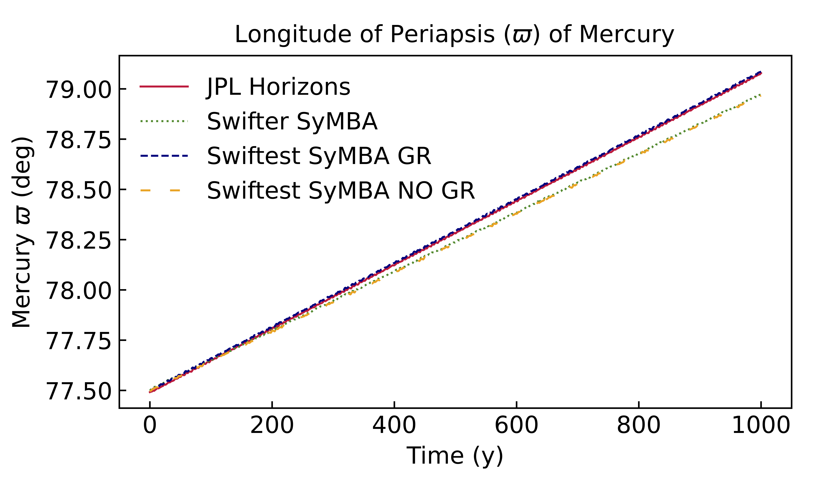

# Swiftest User Manual
### The Purdue University Swiftest Team
#### Carlisle Wishard, David Minton, Jennifer Pouplin, Jake Elliott, & Dana Singh

---

Swiftest is a software packaged designed to model the dynamical evolution of gravitational systems. Swiftest is an extension of the [Swifter](https://www.boulder.swri.edu/swifter/) software package, detailed in Duncan, Levison, and Lee (1998), that incorporates modern programming techniques and performance improvements. Swiftest contains the following numerical integrators:

- **Wisdom-Holman Mapping (WHM)** - A symplectic n-body mapping method. See [Wisdom & Holman (1991)](https://ui.adsabs.harvard.edu/abs/1991AJ....102.1528W/abstract). 
- **Regularized Mixed Variable Symplectic (RMVS)** - An extension of WHM that is capable of handling close encounters between test particles and massive bodies. See [Levison & Duncan (1994)](https://www.sciencedirect.com/science/article/pii/S0019103584710396?via%3Dihub).
- **Democratic Heliocentric (HELIO)** - A symplectic integrator that uses the democratic heliocentric coordinate frame. See [Duncan, Levison, & Lee (1998)](https://iopscience.iop.org/article/10.1086/300541).
- **Symplectic Massive Body Algorithm (SyMBA)** - An extension of HELIO that is capable of handling close encounters between massive bodies. See [Duncan, Levison, & Lee (1998)](https://iopscience.iop.org/article/10.1086/300541). 

Swiftest also includes the collisional fragmentation algorithm **Fraggle**, an addition to the SyMBA integrator. Fraggle is designed to resolve collisions between massive bodies by determining the collisional regime, derived from the work of [Leinhardt & Stewart (2012)](https://iopscience.iop.org/article/10.1088/0004-637X/745/1/79), and generating the appropriate mass distribution of fragments. Swiftest fully incorporates collisional fragments into the gravitational system, evolving these new bodies along with pre-existing bodies, including their growth and any future fragmentation events in which they are involved. 

---

#### Installation

For most users, installing swiftest can be done via pip using the command:

```
pip install swiftest
```

This will install the `swiftest` Python package, which can be incorporated into Python projects using `import swiftest`. It also will install a standalone executable called `swiftest_driver`, which can execute simulations from the command line, provided that initial conditions and configuration files are available in the path. 

**Building the `swiftest` Python package and standalone `swiftest_driver` executable**

Swiftest is designed to be downloaded, compiled, and run on a Linux or MacOS based system. Windows support is currently being developed.

It is possible to download, compile, and run Swiftest on a machine with at least 400 MB of free disk space and 8 GB of RAM. To take full advantage of the parallelization and performance updates included in Swiftest, it is highly recommended that Swiftest be installed on a high-performance computing cluster. For reference, Swiftest is maintained on the Purdue University [Bell Community Cluster](https://www.rcac.purdue.edu/compute/bell). 

Swiftest is written in Modern Fortran and must be compiled using an appropriate compiler. We recommend the Intel Fortran Compiler Classic (ifort) version 19.0 or higher. For details on installing ifort, see the [Intel installation documentation](https://www.intel.com/content/www/us/en/developer/tools/oneapi/fortran-compiler.html#gs.6xhjgy). The GCC/GNU Fortran Compiler (gfortran) version 9 or higher is also compatible. For details on installing gfortran, see the [GNU Fortran documentation](https://gcc.gnu.org/wiki/GFortran).

Swiftest output files are stored in the NetCDF file format. This takes the place of the flat binary output file included in Swifter (and its predecessor [Swift](https://www.boulder.swri.edu/~hal/swift.html)). The NetCDF output format is compatible with Python, Java, and other languages that can be used to process and analyze simulation data. Details on installing NetCDF and the NetCDF Fortran Library can be found on the [Unidata website](https://docs.unidata.ucar.edu/netcdf-fortran/current/). NetCDF is built on HDF5 and it is necessary to install HDF and HDF5 as well. Details on installing HDF and HDF5 can be found on the [HDF Group website](https://www.hdfgroup.org/solutions/hdf5).

Parallelization in Swiftest is done with OpenMP. Version 3.1.4 or higher is necessary to make use of parallelization in Swiftest. If Swiftest is only to be run in serial, this package is not necessary. See the [OpenMP website](https://www.openmp.org/resources/openmp-compilers-tools/) for more details and installation instructions.

*Example of a module configuration that is necessary for compiling and running Swiftest:*
```
1. intel/19.0.5.281
2. openmpi/3.1.4
3. netcdf/4.7.4
4. netcdf-fortran/4.5.3
5. hdf/4.2.15
6. hdf5/1.10.6
```

**Downloading Swiftest**

The easiest way to get Swiftest on your machine is to clone the GitHub repository. To do so, open a terminal window and type the following:

```
$ git clone https://github.com/carlislewishard/swiftest.git
```

If your cloned version is not already set to the master branch:

```
$ git checkout master
```

To pull down any updates to Swiftest:

```
$ git pull
```

You now have a Swiftest repository on your personal machine that you may compile, edit, and run as you see fit.

**Compiling the Swiftest driver program**

***Compiling `swiftest_driver` using Docker***

By far the simplest, most reliable way of compiling the driver program is via a Docker container. The Swiftest project contains a Dockerfile that may be used to generate an executable without needing to provide any external dependencies, other than the Docker engine itself (see [here](https://docs.docker.com/get-docker/) for instructions on obtaining Docker). Once Docker is installed and the Docker engine is running, execute:
```
$ docker build --target=export_driver \
               --output=bin \
               --build-arg MACHINE_CODE_VALUE="Host"  \
             [ --build-arg BUILD_TYPE="*RELEASE*|DEBUG|TESTING|PROFILE" ] \
             [ --build-arg EXTRA_CMAKE_OPTIONS="-D<Additional option you want to pass to CMake>" ]
```

The Docker build will download and compile all of the library dependencies (HDF5, NetCDF-C, and NetCDF-Fortran) as static libraries and the Swiftest driver using Intel compilers. Once completed, the Swiftest executable, called ```swiftest_driver```, should now be created in the ```bin/``` directory. 

> Note: The Dockerfile is designed to build an executable that is compatible with a broad range of CPU architectures by specifying the SSE2 instruction as a target for SIMD instructions using the `-x` compiler option. When compiling on the same CPU archictecture you plan to execute the driver program, for the highest possible SIMD performance, use `--build-arg MACHINE_CODE_VALUE="Host" to override the default `MACHINE_CODE_VALUE="SSE2"`. For additional options see [here](https://www.intel.com/content/www/us/en/docs/fortran-compiler/developer-guide-reference/2023-1/x-qx.html).

The optional Docker argument `EXTRA_CMAKE_OPTIONS` is provided to pass any additional CMake arguments (see below).

***Compiling `swiftest_driver` using CMake***
Several build scripts are available in the `buildscripts` folder for building Swiftest and its dependencies on a Linux or Mac system. These are used when generating the official Swiftest Python wheels using cibuildwheel. To build the complete project, run `buildscripts\build_all.sh` from the command line. 

***Compiling `swiftest_driver` using CMake***

The Swiftest driver program is written in modern Fortran and must be compiled before it can be run. After compilation, an executable, called the `swiftest_driver``, will have been created in the ```bin/``` directory. 

Swiftest is compiled through [CMake](https://cmake.org/). Compiling with CMake has a number of benefits that provide a streamlined experience for the Swiftest user and developer. At compilation, CMake will automatically select the set of flags that are compatible with the local compiler. CMake also allows a Swiftest developer to re-compile only the files that have been edited, instead of requiring the developer to re-compile the entire Swiftest program. Please visit the CMake website for more information on how to install CMake.

As mentioned in the **System Requirements** section, Swiftest requires the NetCDF and NetCDF Fortran libraries to be installed prior to compilation. If the libraries are installed in the standard library location on your machine, CMake should be able to find the libraries without specifying the path. However, if CMake struggles to find the NetCDF libraries, there are two ways to set the path to these libraries.

1. Create an environment variable called ```NETCDF_FORTRAN_HOME``` that contains the path to the location where the libraries are installed
2.  Set the path at the build step using ```-CMAKE_PREFIX_PATH=/path/to/netcdf/```

CMake allows the user to specify a set of compiler flags to use during compilation. We define five sets of compiler flags: release, testing, profile, math, and debug. To view and/or edit the flags included in each set, see ```swiftest/cmake/Modules/SetFortranFlags.cmake```.

As a general rule, the release flags are fully optimized and best used when running Swiftest with the goal of generating results. This is the default set of flags. When making changes to the Swiftest source code, it is best to compile Swiftest using the debug set of flags. You may also define your own set of compiler flags. 

Navigate to the topmost directory in your Swiftest repository. It is best practice to create a ```build``` directory in your topmost directory from which you will compile Swiftest. This way, temporary CMake files will not clutter up the ```swiftest/src/``` sub-directories. The commands to build the source code into a ```build``` directory and compile Swiftest are:

```
$ cmake -B build -S .
$ cmake --build build
```
The [CMake Fortran template](https://github.com/SethMMorton/cmake_fortran_template) comes with a script that can be used to clean out any build artifacts and start from scratch:

```
$ cmake -P distclean.cmake
```

The Swiftest CMake configuration comes with several customization options:

| Option                          | CMake command                                              |
| --------------------------------|------------------------------------------------------------|
| Build type                      | \-DCMAKE_BUILD_TYPE=[**RELEASE**\|DEBUG\|TESTING\|PROFILE] |
| Enable/Disable OpenMP support   | \-DUSE_OPENMP=[**ON**\|OFF]                                |
| Enable/Disable SIMD directives  | \-DUSE_SIMD=[**ON**\|OFF]                                  |
| Enable/Disable Coarray support (experimental) | \-DUSE_COARRAY=[ON\|**OFF**]                 |
| Set Fortran compiler path       | \-DCMAKE_Fortran_COMPILER=/path/to/fortran/compiler        |
| Set path to make program        | \-DCMAKE_MAKE_PROGRAM=/path/to/make                        |
| Enable/Disable shared libraries (Intel only) | \-DBUILD_SHARED_LIBS=[**ON\|OFF]              |
| Add additional include path     | \-DCMAKE_Fortran_FLAGS="-I/path/to/libraries               |
| Install prefix                  | \-DCMAKE_INSTALL_PREFIX=["/path/to/install"\|**"/usr/local"**] |


To see a list of all possible options available to CMake:
```
$ cmake -B build -S . -LA
```

The Swiftest executable, called `swiftest_driver`, should now be created in the `bin/` directory.


**Download the `swiftest_driver` as a Docker or Singularity container.**

The Swiftest driver is available as a Docker container on DockerHub in two versions: Intel and GNU. The Intel version was compiled for the x86_64 CPU using the Intel classic Fortran compiler. The GNU version was compliled for the x86_64 CPU using gfortran. The Intel version is faster than the GNU version (though not as fast as a native compile to the target CPU that you wish to run it on due to vectorization optimizations that Swiftest takes advantage of), however it is much larger: The Intel version is ~2.7GB while the GNU version is ~300MB. The Singularity container pulls from the same DockerHub container.

To facilitate installation of the container, we provide a set of shell scripts to help automate the process of installing container versions of the executable. To install the default Intel version of the docker container from within the `swiftest\` project directory

```
$ cd docker
$ . ./install.sh
```

To install the GNU version:

```
$ cd docker
$ . ./install.sh gnu
```

The Singularity versions are installed the same way, just replace `cd docker` with `cd singularity` above. 

Whether installing either the Docker or Singularity containers, the install script will copy an executable shell script `swiftest_driver` into `swiftest/bin/`. Not that when installing the Singularity container, the install script will set an environment variable called `SWIFTEST_SIF` that must point to the aboslute path of the container file called `swiftest_driver.sif`. To use the driver script in a future shell, rather than running the install script again, we suggest adding the environment variable definition to your shell startup script (e.g. add `export SWIFTEST_SIF="/path/to/swiftest/singularity/swiftest.sif"` to your `.zshrc`)


**Swiftest Python Package**

Included with Swiftest, in the ```/swiftest/python/swiftest/``` directory, is a Python package designed to facilitate seamless data processing and analysis. The Python package, also called Swiftest, can be used to generate input files, run Swiftest simulations, and process output files in the NetCDF file format.

To begin, Swiftest can be added to an existing conda environment, or a new conda environment may be created, so long as the required packages are installed. To create and activate a new conda environment with the prerequisite packages, open a terminal and navigate to the ```/swiftest/python/swiftest/``` directory. Type the following:

```
$ conda create --name EnvName pip scipy numpy matplotlib pandas xarray jupyter astropy -y
$ conda activate EnvName
```

Next, we will install further required packages. Using the ```-e``` flag imports all packages in ```/swiftest/python/swiftest/requirements.txt```, including Swiftest. If the Swiftest Python package is updated in the future, using the ```-e``` flag should ensure that the user does not have to reinstall the package to use the updated version.

```
$ pip install --user -e . 
```

The Swiftest Python package should now be installed in the conda environment and is ready to use. If you would like to take the further step to add Swiftest to a Jupyter Notebook kernel, type the following:

```
$ ipython kernel install --user --name EnvName --display-name "Swiftest Kernel" 
```

---

#### Usage

Swiftest is built to make running a Swiftest simulation a streamlined and user-friendly experience, even for a new user. As a result, Swiftest is highly flexible and a simulation can be created, run, and processed in a number of different ways. The first choice the user must make is if they would prefer ASCII input files or NetCDF input files. We recommend NetCDF input files, however we include documentation for ASCII input files for completeness.

**Brief Outline**

To create and run a Swiftest simulation using the Swiftest Python package, follow the general script below. For more details on the input files and user options, continue reading this section.

```
import swiftest                                                  # Import the Swiftest Python package
sim = swiftest.Simulation(simdir = "directory_name", **kwargs)   # Initialize a Swiftest simulation and define a directory/path in which to store simulation data
sim.add_solar_system_body(**kwargs)                              # Add any desired named Solar System bodies, including the Sun
sim.add_body(**kwargs)                                           # Add any desired user defined bodies
sim.get_parameter(**kwargs)                                      # View the default simulation parameters
sim.set_parameter(**kwargs)                                      # Set any desired simulation parameters
sim.write_param(**kwargs)                                        # Write simulation parameters to the param.in
sim.save(**kwargs)                                               # Save the simulation initial conditions to init_cond.nc
sim.run(**kwargs)                                                # Run the simulation (leave off if running from the executable)
```

To read in a set of Swiftest output files using the Swiftest Python package, follow the general script below. For more details on the output files and user options, continue reading this section.

```
import swiftest                                                              # Import the Swiftest Python package
sim = swiftest.Simulation(simdir = "directory_name", read_data=True)         # Initialize a Swiftest simulation
sim.data                                                                     # Body data over time
sim.init_cond                                                                # The initial conditions for the simulation
sim.encounters                                                               # Encounter data for all close encountering pairs
sim.collisions                                                               # Collision data for all colliders and collisional fragments
```

**NetCDF Input Files (Recommended)**

Swiftest accepts a single NetCDF input file. This file can be created using the Swiftest Python Package through a few simple steps.

To begin, simply create a new Python script in the directory you would like to store your simulation. Open the new script and import the Swiftest Python package.

```
import swiftest          
```

Next, we initialize the Swiftest simulation object. Various parameters can be provided to the simulation via key word arguments at this stage. 

```
sim = swiftest.Simulation(simdir = "directory_name", **kwargs)   
```

The argument ```simdir``` is the name of the subdirectory in which to store all simulation data. This does not have to exist at the time the simulation object is initialized.

The key word arguments available to the user, along with the default values for these arguments, are described in [simulation_kwargs](README_tables/simulation_kwargs.md).

After creating the simulation and defining all desired parameters as keyword arguments, it is time to add bodies to the simulation. The Swiftest Python package interfaces with the [NASA JPL Horizons database](https://ssd.jpl.nasa.gov/horizons/), allowing a user to easily import the initial conditions of known solar system bodies using the ```add_solar_system_body``` method.

```
sim.add_solar_system_body(["Sun","Mercury","Venus","Earth","Mars","Jupiter","Saturn","Uranus","Neptune","Pluto"])     
```

User defined bodies can also be added to a Swiftest simulation through the Python package. Massive bodies and test particles can both be added using the ```add_body``` method. 

```
sim.add_body(**kwargs)
```

The key word arguments available to the user for the ```add_body``` method are described in [add_body_kwargs](README_tables/add_body_kwargs.md).

Once all desired bodies have been added to the Swiftest simulation, the simulation parameters can be accessed and changed using the ```get_parameter``` and ```set_parameter``` methods. The key word arguments available to the user for the ```get_parameter``` and ```set_parameter``` are the same as those described in [simulation_kwargs](README_tables/simulation_kwargs.md).

After all desired parameters have been set, the parameters can be saved to the **param<span>.in</span>** using the ```write_param``` method. The key word arguments available to the user for the ```write_param``` method are described in [write_param_kwargs](README_tables/write_param_kwargs.md).

The state of the system can be saved to the initial conditions NetCDF file, **<span>init_cond.nc</span>**, using the ```save``` method. The key word arguments available to the user for the ```save``` method are described in [save_kwargs](README_tables/save_kwargs.md).

Finally, a simulation can be run from the same script in which it is created (or a separate Python script) using the ```run``` method. This is optional as the simulation can also be run from an executable. More details on running a Swiftest simulation can be found in the section **Running a Swiftest Simulation**. The key word arguments available to the user for the ```run``` method are the same as those described in [simulation_kwargs](README_tables/simulation_kwargs.md).

**ASCII Input Files**
Swiftest accepts 4 ASCII input files. All four ASCII input files are necessary if using the ASCII input format, however the structure of each input file varies slightly depending on the features and capabilities of the integrator selected. The four ASCII input files are not necessary if using NetCDF input files. The four input files are as follows:

- **<span>param.in</span>** - The parameter input file.
- **<span>cb.in</span>** - The central body input file.
- **<span>pl.in</span>** - The massive body input file.
- **<span>tp.in</span>** - The test particle input file.

The parameter options used in the parameter input file are as described in [simulation_kwargs](README_tables/simulation_kwargs.md).

The **<span>cb.in</span>** includes all central body initial conditions. The structure of the **<span>cb.in</span>** is as follows:

```
0                 ! ID number
1.0               ! Gravitational mass (G*mass) in mass units (ex. 39.47841760435743 for Sun in M_sun/AU/year)
1.0               ! Central body radius is distance units (ex. 0.004650467260962157 for Sun in AU)
0.0               ! J2 term, optional, set to 0.0 for a spherical body
0.0               ! J4 term, optional, set to 0.0 for a spherical body
0.4 0.4 0.4       ! Principal moments of inertia, optional, leave off if not using, SyMBA only
0.0 0.0 0.0       ! Rotational vectors in radians per second, optional, leave off if not using, SyMBA only
```

The **<span>pl.in</span>** includes all massive body initial conditions. The structure of the  **<span>pl.in</span>** is as follows:

```
2                 ! Total number of massive bodies
1, 0.0, 0.0       ! ID number, Gravitational mass (G*mass) in mass units, Hill Radius in distance units if RHILL_PRESENT is set to YES, leave off if not using
0.0               ! Radius is distance units if CHK_CLOSE is set to YES, leave off if not using
1.0 1.0 1.0       ! If IN_FORM is set to XV then this is the heliocentric position vector, if it is set to EL then this is the semi-major axis, the eccentricity, and the inclination
1.0 1.0 1.0       ! If IN_FORM is set to XV then this is the heliocentric velocity vector, if it is set to EL then this is the longitude of the ascending node, the argument of pericenter, and the mean anomaly
0.4 0.4 0.4       ! Principal moments of inertia, optional, leave off if not using, SyMBA only
1.0 1.0 1.0       ! Rotational vectors in radians per second, optional, leave off if not using, SyMBA only
2, 0.0, 0.0       
0.0               
1.0 1.0 1.0       
1.0 1.0 1.0       
0.4 0.4 0.4       
1.0 1.0 1.0        
```

The **<span>tp.in</span>** includes all test particle initial conditions. In the event that no test particles are desired, the **<span>tp.in</span>** must still be included, however it can simply contain a single ```0```. The structure of the **<span>tp.in</span>** is as follows:

```
2                 ! Total number of test particles 
3                 ! ID number
1.0 1.0 1.0       ! If IN_FORM is set to XV then this is the heliocentric position vector, if it is set to EL then this is the semi-major axis, the eccentricity, and the inclination
1.0 1.0 1.0       ! If IN_FORM is set to XV then this is the heliocentric velocity vector, if it is set to EL then this is the longitude of the ascending node, the argument of pericenter, and the mean anomaly
4                 
1.0 1.0 1.0       
1.0 1.0 1.0       
```

Note that the ID numbers of the test particles are a continuation of the ID numbers of the massive bodies. No two bodies in the system can have the same ID number. 

**Running a Swiftest Simulation**

The input files necessary to successfully run Swiftest should now be generated in the simulation directory. The user is now faced with a second choice: to run a Swiftest simulation from a Python environment or to run it directly from an executable. Either option is possible with NetCDF format input files, however ASCII input files must be run directly from an executable.

**Running via Python**

To run a Swiftest simulation from the same script in which the initial conditions are created, simply add the following line after you have finished defining parameters and adding bodies to the simulation:

```
sim.run()
```

To run a previously created set of initial conditions, first read the old parameter file into Python, and then run it. Note that Swiftest will look in the ```/simdata``` subdirectory for the initial conditions by default. You may set a new path to the initial conditions using the ```param_file``` keyword argument. See the documentation detailing the key word arguments available to the user in [simulation_kwargs](README_tables/simulation_kwargs.md).

```
sim = swiftest.Simulation(simdir = "directory_name", read_param=True)
sim.run()
```

**Running via an Executable**

To run a Swiftest simulation through an executable, create a symbolic link to the Swiftest driver from your current directory.

```
$ ln -s ~/PATH/TO/swiftest/bin/swiftest_driver .
```

To run Swiftest, simply type the following command into the terminal:

```
$ ./swiftest_driver INTEGRATOR param.in
```

Where ```INTEGRATOR``` is your integrator of choice, either ```whm```, ```rmvs```, ```helio```, or ```symba```. 

**Outputs**

The number and type of output files generated by Swiftest depends on the input parameters selected and the method through which Swiftest was run. The standard output files are as follows:
- **<span>data.nc</span>** - Always generated, the output file containing the information for every body in the system, recorded every ```ISTEP_OUT``` timesteps and written every ```DUMP_CADENCE```. This file can be analyzed using the Swiftest Python package (```sim.data```).
- **collisions.log** - The log containing the record of each fragmentation event, including the collisional regime, and the number of the fragments created, only if ```FRAGMENTATION``` is ```YES```, Swiftest SyMBA only.
- **swiftest.log** - A log containing a brief update on the status of the run. Only generated if Swiftest is run through the Python package or through a shell script. If Swiftest is run through an executable, these updates are output directly to the terminal.
- **collisions<span>.nc</span>** - The details of each collision that occurs in a simulation are recorded in a NetCDF file. Only if ```CHK_CLOSE```/```close_encounter_check``` is ```YES```/```True```. This file can be analyzed using the Swiftest Python package (```sim.collisions```).
- **encounters<span>.nc</span>** - The details of each close encounter that occurs in a simulation are recorded in a NetCDF file. Only if ```CHK_CLOSE```/```close_encounter_check``` is ```YES```/```True```. This file can be analyzed using the Swiftest Python package (```sim.encounters```).
- **init_cond.nc** - The initial conditions used to run the simulation. This file can be analyzed using the Swiftest Python package (```sim.init_cond```).
- **encounter_check_plpl_timer.log** - The log containing the encounter check timer for each massive body/massive body encounter,  only if ```CHK_CLOSE```/```close_encounter_check``` is ```YES```/```True``` and ```ENCOUNTER_CHECK```/```encounter_check_loops``` is ```ADAPTIVE```.
- **encounter_check_pltp_time.log** - The log containing the encounter check timer for each massive body/test particle encounter, only if ```CHK_CLOSE```/```close_encounter_check``` is ```YES```/```True``` and ```ENCOUNTER_CHECK```/```encounter_check_loops``` is ```ADAPTIVE```.
- **interaction_timer.log** - The log containing the interaction loop timer for each interacting pair of bodies, only if ```INTERACTION_LOOPS``` is ```ADAPTIVE```.

To read in a Swiftest output file, simply create a new Python script in the simulation directory.

```
import swiftest                                            
sim = swiftest.Simulation(simdir = "directory_name", read_data=True) 
```

All Swiftest data is now stored in the Xarray datasets ```sim.data```, ```sim.collisions```, and ```sim.encounters``` and is easily processed, manipulated, and analyzed.

Regardless of whether the status outputs are recorded in the **swiftest.log** or in the terminal, the output format is the same. Below is an example of a single status output:

``````
Time =  1.00000E+03; fraction done =  0.001; Number of active plm, pl, tp =    57,   108,    50
  DL/L0 =  6.83763E-12; DEcollisions/|E0| =  0.00000E+00; D(Eorbit+Ecollisions)/|E0| =  2.65579E-03; DM/M0 =  0.00000E+00
Integration steps: Total wall time:  2.99848E+02; Interval wall time:  9.36192E+01;Interval wall time/step:   4.68956E-04
``````

The first line includes the simulation time, the fraction of the simulation that is complete relative to ```tstop```, the number of fully-interactive massive bodies (```plm```) (SyMBA only), the total number of massive bodies (```pl```) including fully-interactive and semi-interactive bodies, and the number of test particles (```tp```) remaining in the system at that time. The second line includes the angular momentum error, the change in energy as a result of collisions only, the total change in energy, and the change in mass up to this point in the simulation (error analysis included only if ```ENERGY```/```compute_conservation_values``` is set to ```YES```/```True```). The third line contains the total wall time elapsed since the start of the simulation, the wall time elapsed since the start of the last step, and the average wall time per step since the start of the simulation.

**Restarting a Simulation From t $\neq$ 0**

Just like Swiftest allows the user to run a simulation through an executable or through Python, Swiftest also allows the user to restart a simulation from t $\neq$ 0 in the same two manners. This can be useful in the case of an accidental termination of a simulation, such as through a power outage or computer failure. In many cases, it is also necessary to run a simulation to a new end point, past the original ```TSTOP```.

**Restarting via Python**

To restart a Swiftest simulation via the Swiftest Python package, follow the outline below:

```
import swiftest
sim = swiftest.Simulation(simdir = "directory_name", read_data=True)
sim.set_parameter(tstop=VAL)  # Set a new stop time if desired
sim.write_param()             # Write simulation parameters to the param.in
sim.run()
```

Note that Swiftest will look in the ```/simdata``` subdirectory for the initial conditions by default. You may set a new path to the initial conditions using the ```param_file``` keyword argument.

**Restarting via an Executable**

Every ```DUMP_CADENCE``` X ```ISTEP_OUT``` timesteps, Swiftest writes all simulation information from memory to the output files. At the same time, Swiftest also writes all simulation information to a new parameter file, titled **<span>param.XXXXXXXXXXXXXXXXXX.in</span>**. To restart a run from a previous parameter file, simply follow the instructions detailed in the **Running via an Executable** section, replacing ```param.in``` with the name of the parameter file from which you wish to restart. 

---

#### Updates to Swifter Included in Swiftest

**Collisional Fragmentation via Fraggle**

To activate the Fraggle algorithm, set ```FRAGMENTATION```/```fragmentation``` to ```YES```/```True```, depending on the mode in which Swiftest is being run. When resolving a close encounter that results in a collision, Fraggle determines the regime of the collision as well as the mass, number, position, velocity, and rotation of all resulting bodies. This is distinct from Swiftest SyMBA's predecessor, Swifter SyMBA, which assumes that all collisions result in perfect mergers. 

Fraggle distinguishes the following collisional regimes: (1) perfect merging, which includes the cratering, partial accretion, and graze-and-merge regimes of Leinhardt & Stewart 2012, (2) disruption, which includes the partial erosion regime of Leinhardt & Stewart 2012, (3) super-catastrophic disruption, and (4) hit-and-run events which can be either ‘pure’ or ‘disruptive’.

For every collision throughout the course of a simulation, Fraggle writes a brief description of the collision to the **fraggle.log** output file. An example of a collision, stored in the **fraggle.log** output file, is as follows:

```
Fraggle logfile

  **********************************************************************************************************************
 Collision between massive bodies detected at time t = 2.063709800335315E-006
 **********************************************************************************************************************

 --------------------------------------------------------------------
            Fraggle collisional regime determination results
 --------------------------------------------------------------------
 True number of colliders :            2
 Index list of true colliders  :            1           2
 Regime: Disruption
 Energy loss                  :   2.298848838233116E-022
 --------------------------------------------------------------------
 Disruption between Target (1) and Projectile (2)
 Fraggle generating 28 fragments.
 Fraggle try 1
 Fraggle fragment generation succeeded after 1 tries
 Generating 28 fragments
```

The details of the collision are stored in the simulation object (```sim.collisions```) which can be accessed using the Swiftest Python package.

**General Relativity**

From its observation in the mid-1800s to the development of the theory of general relativity by Albert Einstein in 1915, the precession of Mercury's perihelion puzzled scientists and observers. Mercury's orbit precesses by approximately $42.980 \pm 0.001$ arcseconds / century more than is expected from Newtonian mechanics. This deviation can be explained by the curvature of spacetime due to the mass of the Sun. Mercury's close proximity to the Sun enhances the effects of general relativity, providing a good test case to highlight the functionality of general relativity in Swiftest. 

In this test case, we track the orbit of Mercury for 1000 years as it orbits around the Sun in the presence of the seven other massive planets. The precession rate of the longitude of periapsis of Mercury, as calculated by Swiftest SyMBA, differs by only $\sim 0.0286 \%$ from the precession rate calculated from the NASA JPL Horizons database.

||
|:--:|
|**Figure 1** - The longitude of periapsis of Mercury over 1000 years, as calculated by Swifter SyMBA (dotted green), Swiftest SyMBA with general relativity turned off (long dashed yellow), and Swiftest SyMBA with general relativity turned on (short dashed blue). These results are compared to the periapsis of Mercury as calculated from the NASA JPL Horizons database (solid red). Swiftest SyMBA with general relativity turned off is in good agreement with Swifter SyMBA ($\sim 0.00053 \%$ difference), while Swiftest SyMBA with general relativity turned on is in good agreement with the NASA JPL Horizons database ($\sim 0.0286 \%$ difference).| 

**Adaptive Interaction Calculations and Encounter Checking**

In Swifter SyMBA, gravitational interactions between bodies are calculated on a pair-by-pair basis by solving an upper triangular matrix. In practice, this is done through a double loop. While effective, solving a triangular matrix is computationally costly and it is considered best practice to avoid nested loops wherever possible. Swiftest SyMBA offers an alternative to this method, allowing the user to choose between calculating the gravitational interactions between bodies through a traditional triangular matrix or through a flattened Euclidean distance matrix.

A Euclidean distance matrix is a two-dimensional array that stores the distance between each pairing of points in a set of elements. For more details on the algorithm implemented in Swiftest to flatten the Euclidean distance matrix, please see [Angeletti, Bonny, & Koko 2019](https://hal.archives-ouvertes.fr/hal-02047514).

Along with allowing the user to choose whether the gravitational interactions are calculated through an upper triangular matrix or a flattened Euclidean distance matrix, Swiftest SyMBA allows the user to let the program determine the speedier solution. Through adaptive interaction calculations, Swiftest SyMBA periodically tracks the time it takes to complete an interaction calculation using both the triangular and flat methods. Whichever method proves to be quicker is implemented until the next time both methods are tested. Swiftest SyMBA periodically checks the performance of each method, possibly switching between the two methods multiple times over the course of a simulation. By selecting adaptive interaction calculations, the user allows Swiftest SyMBA to optimize its own performance and adapt to changes in the number of particle pairings as the simulation progresses.

An example of the adaptive interaction calculations, stored in the **interaction_timer.log** output file, is as follows:

```
Interaction loop timer logfile                                                ! The file header
Diagnostic values: loop style, time count, nplpl, metric                      ! The diagnostic values used to determine which calculation method is fastest
symba_kick_getacch_int_pl: loop timer turned on at t = 0.000000000000000E+000 ! The subroutine in which the timing is being conducted and the time (in simulation time) at which the timer is begun
symba_kick_getacch_int_pl: stage 1                                            ! Begins timing the first method
FLAT        95 7353 1.291989664082687E-002                                    ! The calculation method type, the time (in seconds) to calculate all interactions, the number of massive body / massive body interactions, and the time per interaction (time / number of interactions)
symba_kick_getacch_int_pl: stage 2                                            ! Begins timing the second method
TRIANGULAR  100 7353 1.359989120087039E-002                                   ! The calculation method type, the time (in seconds) to calculate all interactions, the number of massive body / massive body interactions, and the time per interaction (time / number of interactions)
symba_kick_getacch_int_pl: the fastest loop method tested is FLAT             ! The subroutine in which the timing is being conducted and which interaction calculation method is determined to be fastest
```

In addition to calculating the gravitational interactions between pairings of bodies, Swifter SyMBA also uses an upper triangular matrix to check if pairings of bodies are in a close encounter state. While similar to interaction calculations, encounter checking can be further simplified to exclude pairs of bodies which, based on their physical distance, are unlikely to be in an encounter state. To address this, Swiftest SyMBA offers an alternative to solving an upper triangular matrix through the sort and sweep method.

The sort and sweep method of collision detection (see [Ericson 2005](https://www.sciencedirect.com/book/9781558607323/real-time-collision-detection) for more details), also known as the sweep and prune method, is a way of limiting the number of pairs of bodies that need to be checked for a collision in each time step. At the start of a new time step, the position of each body is calculated and the critical radius of each body is determined. The critical radius is based on the radius of a body's Hill sphere. The distance from a body's center to the extent of its critical radius defines the encounter sphere of the body. The position of the center of mass of the body and the extent of its encounter sphere are used to define the bounding box used in the sort and sweep algorithm. Based on the defined bounding box, the positions of the lower and upper bounds of all of the bodies in the simulation are compiled into sorted lists. Because each body is unlikely to move significantly between time steps, updating these sorted lists each time step is relatively straightforward. Only when the bounding boxes of two bodies overlap in all axes are the bodies flagged as an encountering pair. 

The sort and sweep algorithm is computationally efficient because it limits the number of potential encountering pairs that must be checked for encounters. For example, by calculating the bounding boxes of two bodies on opposite sides of the solar system, the algorithm then sorts the upper and lower bounds of these two bounding boxes into opposite ends of a sorted list. Through this sorting, the algorithm recognizes that these two bodies are unlikely to encounter one another in the following time step and is able to quickly exclude them from more extensive encounter checking, saving time and computational resources.  
In the same way that the user can allow Swiftest SyMBA to adapt when calculating the gravitational interactions between bodies, the user can also allow Swiftest SyMBA to determine the faster method of encounter checking. Just as Swiftest SyMBA periodically tests the interaction calculation methods, it also periodically tests the encounter checking methods. The quicker of the two methods is selected and implemented, allowing Swiftest SyMBA to adapt to changes in the distribution of bodies in the system as the simulation progresses.

An example of the adaptive encounter checking, stored in the **encounter_check_plpl_timer.log** output file, is as follows:

```
Encounter check loop timer logfile                                           ! The file header
Diagnostic values: loop style, time count, nplpl, metric                     ! The diagnostic values used to determine which checking method is fastest
encounter_check_all_plpl: loop timer turned on at t = 5.000000000000000E-003 ! The subroutine in which the timing is being conducted and the time (in simulation time) at which the timer is begun
encounter_check_all_plpl: stage 1                                            ! Begins timing the first method
SORTSWEEP   196 7353 2.665578675370597E-002                                  ! The checking method type, the time (in seconds) to check all possible encounters, the number of possible massive body / massive body encounters, and the time per encounter (time / number of possible encounters)
encounter_check_all_plpl: stage 2                                            ! Begins timing the second method
TRIANGULAR  164 7353 2.230382156942744E-002                                  ! The checking method type, the time (in seconds) to check all possible encounters, the number of possible massive body / massive body encounters, and the time per encounter (time / number of possible encounters)
encounter_check_all_plpl: the fastest loop method tested is TRIANGULAR       ! The subroutine in which the timing is being conducted and which encounter checking method is determined to be fastest
```

Together, adaptive interaction calculations and encounter checking are idea for lengthy simulations with a large number of particles. The flexibility of Swiftest SyMBA ensures that the parameters of the integration are optimized for each individual simulation, even as the simulation evolves. 

**NetCDF Compatibility**

The NetCDF (Network Common Data Form) file format is a cross-platform method of creating, accessing, and sharing data. Due to its self-describing nature, NetCDF is ideal for archiving multidimensional scientific data. NetCDF files are also appendable, allowing for data to be added to a file after creation, making the NetCDF file format well suited for handling simulation output. NetCDF is maintained by the University Corporation for Atmospheric Research (UCAR) and is a standard file format across much of the atmospheric modeling community. 

In Swifter SyMBA, simulation outputs were stored in a flat binary file. These binary files could only be easily accessed through [SwiftVis](https://cs.trinity.edu/~mlewis/SwiftVis/), a data analysis and visualization software package designed to process Swifter data. In accordance with modern data management practices and industry standards, Swiftest incorporates a NetCDF output file format for all simulation types. NetCDF is compatible with many of today's most widely-used programming languages including Fortran, Python, Java, C++, and more. By writing simulation data to a NetCDF output file, Swiftest provides the user with the flexibility to analyze and visualize data in any language they choose. The NetCDF file format is also adaptable such that any future additions to Swiftest can be seamlessly incorporated into the output file. 
                                                    
**Object-Oriented Programming**

The 2003 version of Fortran introduced object-oriented programming, with Fortran 2008 providing further updates. Swiftest is written in modern Fortran and takes advantage of many of the object-oriented programming features included in Fortran 2003. In doing so, Swiftest is a complete restructure of its predecessor, Swifter. The reusability and simplification of code in Swiftest through object-oriented programming is a modern and flexible approach that allows for future enhancements and additions to the Swiftest package.

**Parallelization**

Parallelization using OpenMP is still under development in Swiftest. For preliminary results, see **Figure 2**.

---

#### Examples

All examples are included in the ```/swiftest/examples/``` directory. Simply run the script(s) included in the directory as you would normally run a Python script. See the **README.txt** included in each example directory for more details.

**Basic_Simulation**

This example walks through how to set up a standard solar system simulation. It can be found in the ```/swiftest/examples/Basic_Simulation``` directory. It is intended to be run using the SyMBA integrator. It contains three classes of bodies:
- Fully-Interacting Massive Bodies - Gravitationally affect and are affected by other massive bodies.
- Semi-Interacting Massive Bodies - Gravitationally affect and are affected by fully-interacting massive bodies, do not gravitationally affect and are not affected by other semi-interacting massive bodies.
- Test Particles - Gravitationally affected by fully-interacting massive bodies only. 

To generate the initial conditions, run the Python script titled **basic_simulation.py**. This script also runs Swiftest SyMBA, generating output. To process the output file, run the script titled **output_reader.py**. 

**Chambers2013**

This example acts as a comparison to the work of [Chambers 2013](https://www.sciencedirect.com/science/article/pii/S0019103513000754?via%3Dihub). It can be found in the ```/swiftest/examples/Chambers2013``` directory. It is intended to be run using the SyMBA integrator and highlights how to run Swiftest using and executable, as opposed to through a Python script. To generate the initial conditions, run **init_cond.py**. To run Swiftest with these intial conditions, type:

```
./swiftest_driver symba param.in
```

To process the output file, run the script titled **<span>scattermovie.py</span>**.

**Fragmentation**

This example highlights the functionality of the Fraggle algorithm. It can be found in the ```/swiftest/examples/Fragmentation``` directory. It is intended to be run using the SyMBA integrator. It contains 9 pre-built collisional test cases:

- A Head-On Disruptive Collision 
- An Off-Axis Disruptive Collision 
- A Head-On Super-Catastrophic Disruptive Collision
- An Off-Axis Super-Catastrophic Disruptive Collision
- A Disruptive Hit and Run Collision 
- A Pure Hit and Run Collision
- A Merger
- A Merger Crossing the Spin Barrier
- All of the Above

To generate, run, and create a movie depicting the collision, run the Python script titled **Fragmentation_Movie.py**. Please note that this example requires a large amount of memory. For reference, this example was created and run using 4 nodes, each with 256 GB of memory. This amount of computational memory is necessary to generate a smooth movie. In this example, the trajectories of all bodies involved in the collision are saved at every point in the simulation. This is extremely expensive and should only be used to study a particular collisional event in detail.   

**helio_gr_test**

This example demonstrates the functionality of general relativity in Swiftest HELIO. It can be found in the ```/swiftest/examples/helio_gr_test``` directory. It is intended to be run using the HELIO integrator. Because the SyMBA integrator is built upon the HELIO integrator, GR is also available in SyMBA.

**Multibody_Fragmentation**

This example highlights the functionality of the Fraggle algorithm. It can be found in the ```/swiftest/examples/Mulitbody_Fragmentation``` directory. It is intended to be run using the SyMBA integrator. To generate a set of initial conditions, run the initial conditions using Swiftest, and generate a movie depicting the collisional result, run the Python script titled **Multibody_Movie.py**.

**solar_impact**

This example demonstrates the conservation of angular momentum, energy, and mass during a collision between a massive body and the Sun, or central body. It can be found in the ```/swiftest/examples/solar_impact``` directory. It is intended to be run using the SyMBA integrator. 

**Swifter_Swiftest**

This set of examples acts as a comparison between Swiftest and its predecessor, Swifter. Two unique simulations are included in this example, one with 8 massive bodies and 0 test particles, and one with 108 massive bodies and 50 test particles. These simulations can be found in the ```/swiftest/examples/Swifter_Swiftest/8pl_0tp``` and the ```/swiftest/examples/Swifter_Swiftest/108pl_50tp``` directories, respectively. They are intended to be run using the SyMBA integrator. For details on how to run a simulation using Swifter, please see the [Swifter website](https://www.boulder.swri.edu/swifter/).

**whm_gr_test**

This example demonstrates the functionality of general relativity in Swiftest WHM. It can be found in the ```/swiftest/examples/whm_gr_test``` directory. It is intended to be run using the WHM integrator. Because the SyMBA integrator is built upon the HELIO integrator, which is in turn built upon the WHM integrator, GR is also available in SyMBA.

---

#### Simulation Parameter FAQs and Recommendations

**How do I know what timestep to use for my simulation (**```dt```**)?**

A good rule is to set ```dt``` equal to one tenth the orbit of the inner-most body in your simulation. For example, if Mercury is your inner-most body, ```dt``` should be set to one tenth Mercury's orbit. Mercury's orbit is ~0.24 years (~88 days) so a timestep of 0.024 years should be sufficiently small to accurately model the orbit of Mercury. You can always go smaller to increase resolution.

**How often should I output (**```ISTEP_OUT``` or ```TSTEP_OUT```, **and** ```DUMP_CADENCE```**)?**

Depending on your simulation, you may want to write to the output file more or less frequently. Writing takes a considerable amount of computational time, so it is important to set a output cadence that is manageable. Conversely, storing data in memory may not be reasonable for all simulation configurations or hardware, so writing more frequently may be necessary. There is no hard and fast rule for how often you should output, however it is dependent on your total simulation length (```tmax```) and your timestep (```dt```). Think of ```ISTEP_OUT``` as the number of timesteps between writing to memory (or, alternatively with ```TSTEP_OUT```, the length of time between writing to memory), and ```DUMP_CADENCE``` as the number of write to memory operations between writing to file. 

For example, an appropriate output cadence for a run with a timestep of 0.005 years and a total simulation length of 100 My might be ```ISTEP_OUT = 2e5``` (```TSTEP_OUT = 1e3```) and ```DUMP_CADENCE = 10```. This means that data will be stores to memory every 2e5 timesteps and written to file every 2e6 timesteps. Based on our value of ```dt```, this is every 1,000 years and every 10,000 years, respectively. Our total simulation length tells us that we will write to file 10,000 times over the course of the simulation. For longer simulations, the output cadence may be less frequent to save computational space. For shorter simulations, the output cadence may be more frequent to increase resolution. 

**What mass threshold should I set to differentiate fully-interactive and semi-interactive bodies (**```GMTINY``` **or** ```MTINY```**)?**

Semi-interacting bodies are useful because the integrator is not required to calculate gravitational interactions between pairs of semi-interacting particles. This can result in significant performance improvements, especially for systems that require hundreds or thousands of massive bodies. If your system only has a few tens of massive bodies, semi-interacting bodies may not be necessary. If you would like to differentiate between these two classes of bodies, simply set the mass threshold to be some value between the mass of the smallest fully-interacting body and the mass of the largest semi-interacting body that you choose. Semi-interacting bodies can collide with each other and grow to become fully interacting bodies once they pass the mass threshold.

**What should minimum fragment mass should I use (**```MIN_GMFRAG``` **or** ```MIN_MFRAG```**)?**

This mass threshold is necessary to ensure that Swiftest SyMBA does not generate huge amounts of very small fragments, grinding the model to a halt. While this value is largely empirical and dependent on each specific set of initial conditions, a good place to start is to set the minimum fragment mass threshold to be one tenth the size of the smallest body in your simulation. You can also adjust ```FRAG_REDUCTION``` to keep the number of fragments within a reasonable range.

**What are the limits of Swiftest SyMBA?**

While Swiftest SyMBA is a powerful tool for modeling gravitational interactions between massive bodies, it does have its limits. Swiftest SyMBA is best used for systems containing tens to hundreds of fully-interacting massive bodies. It is also best used for timescales on the order of a few hundred million years or less. While it is possible to model systems on a billion year timescale, the computational power required may be beyond what is available to the average user. In these cases, it is recommended that the user consider modeling with test particles instead of massive bodies. For systems that contain mainly test particles, with few to no close encounters between massive bodies, Swiftest RMVS is likely a more appropriate tool. 

To get a sense of the scope of your desired simulation, it is recommended that you run your initial conditions and parameters for a just few steps. Make sure that you set ```ISTEP_OUT``` and ```DUMP_CADENCE``` to output only once the simulation is complete, not between steps. Because writing to the output files and memory takes a significant amount of computational time compared to integrating the step, we want to avoid counting writing time in our diagnostic information. The terminal output contains information about the total wall time and the wall time per integration step. To get a sense of how long your run will take to complete your desired ```tmax```, simply scale up the wall time per integration step to the number of steps necessary for ```tmax``` to be reached. Remember that writing to the output files will take a considerable amount of time. Adjust your initial conditions and parameters accordingly.

---

#### References

- Angeletti, M., Bonny, J. -M., and Koko, J. (2019). Parallel Euclidean distance matrix computation on big datasets. **HAL**. [HAL Id: hal-02047514](https://hal.archives-ouvertes.fr/hal-02047514) 
- Duncan, M. J., Levison, H. F., and Lee, M. H. (1998). A Multiple Time Step Symplectic Algorithm for Integrating Close Encounters. **The Astronomical Journal**, 116, 2067. [doi: 10.1086/300541](https://iopscience.iop.org/article/10.1086/300541)
- Chambers, J. E. (2013). Late-Stage Planetary Accretion Including Hit-and-Run Collisions and Fragmentation. **Icarus**, 224. [doi: 10.1016/j.icarus.2013.02.015](https://www.sciencedirect.com/science/article/pii/S0019103513000754?via%3Dihub)
- Ericson, C. (2005) Real-Time Collision Detection. **Elsevier Inc.** [ISBN: 978-1-55860-732-3](https://www.sciencedirect.com/book/9781558607323/real-time-collision-detection)
- Leinhardt, Z. M. and Stewart, S. T. (2012). Collisions between Gravity-dominated Bodies. I. Outcome Regimes and Scaling Laws. **The Astrophysical Journal**, 745, 79. [doi:10.1088/0004-637X/745/1/79](https://iopscience.iop.org/article/10.1088/0004-637X/745/1/79)
- Levison, H. F. and Duncan, M. J. (1994). The Long-Term Behavior of Short-Period Comets. **Icarus**, 108, 18. [doi: 10.1006/icar.1994.1039](https://www.sciencedirect.com/science/article/pii/S0019103584710396?via%3Dihub)
- Wisdom, J. and Holman, M. (1991). Symplectic maps for the N-body problem. **The Astronomical Journal**, 102. [doi: 0.1086/115978](https://ui.adsabs.harvard.edu/abs/1991AJ....102.1528W/abstract)
- Wishard et al. (2023) - In preparation

---

#### Community Guidelines

**Contributing to Swiftest**
Swiftest is open source and can be freely accessed through our [GitHub page](https://github.itap.purdue.edu/MintonGroup/swiftest). If you wish to make a change and have that change incorporated into the published version of Swiftest, please issue a pull request. If you wish to edit Swiftest for your own personal use, no pull request is necessary.

**Reporting an Issue**
If you stumble upon a bug or issue with the functionality of Swiftest, we want to hear about it! If you have a fix for this bug, please issue a pull request. If you do not have a fix for the bug and would like to report it, please contact the Purdue Swiftest Team via email (cwishard@purdue.edu).

**User Support**
For help using Swiftest, please contact the Purdue Swiftest Team via email (cwishard@purdue.edu).

---

#### Licensing Agreement

Swiftest is free software: you can redistribute it and/or modify it under the terms of the GNU General Public License as published by the Free Software Foundation, either version 3 of the License, or (at your option) any later version.

Swiftest is distributed in the hope that it will be useful, but WITHOUT ANY WARRANTY; without even the implied warranty of MERCHANTABILITY or FITNESS FOR A PARTICULAR PURPOSE. See the GNU General Public License for more details.

You should have received a copy of the GNU General Public License along with Swiftest. If not, see <https://www.gnu.org/licenses/>. 
