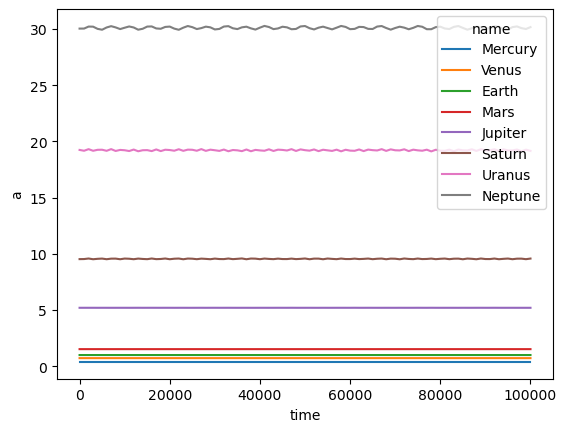

#################
Basic Simulation
#################

.. rubric:: by David A. Minton

Here, we will walk you through the basic features of Swiftest and using them in Python. 

Start with importing Swiftest. ::
    
    import swiftest

Initial Simulation Setup 
===========================

Create a Swiftest :class:`Simulation <swiftest.Simulation>` object.
Outputs are stored in the ``./simdata`` directory by default. ::

   sim = swiftest.Simulation()

Now that we have a simulation object set up (with default parameters), we can add bodies to the simulation. 
The biggest body in the simulation is taken as the central body. 

Solar System Bodies
=========================

We can add solar system bodies to the simulation using the :func:`add_solar_system_body <swiftest.Simulation.add_solar_system_body>` 
method.  This method uses JPL Horizons to extract the parameters. ::
   
   # Add the modern planets and the Sun using the JPL Horizons Database.
   sim.add_solar_system_body(["Sun","Mercury","Venus","Earth","Mars","Jupiter","Saturn","Uranus","Neptune"])


Running the Simulation
========================

Before we run the simulation, we need to set some parameters to control the total length and step size of an integration. Swiftest 
sets a Simulation object up with a set of default parameters, including a default unit system of AU, y, and solar masses. However, 
you are required to set the ``tstop`` and ``dt`` parameters before running the simulation. These control the total time of the 
simulation and the time step size, respectively.

.. note::
    The symplectic integrators used in Swiftest are not adaptive, so the time step size is fixed throughout the simulation.
    Typically you want to choose a step size that is no more than 1/20th of the shortest orbital period in the system. So for the
    solar system, a step size of 0.01 y is a good choice in order to accurately model Mercury's orbit.

Another important consideration is the number of steps you wish to save and how often the output is saved to file (the output 
cadence). By default, Swiftest will save every output step to disk. However, Swiftest is designed to simulate systems for long 
periods of time, so it is often not practical to save every single time step to disk. There are three ways to control how many 
steps are saved to file: ``tstep_out``, ``istep_out``, and ``nstep_out``.

- ``istep_out``: This is the integer number of time steps between output saves to file, which can be used to control the output 
  cadence.  For example, if you set ``istep_out=1000``, then the simulation will save the system every 1000 time steps. This is 
  useful if you want to save the system every N time steps, regardless of the time interval between steps. 

- ``tstep_out``: This is the approximate time interval between output steps. This is the most intuitive way to control the output 
  cadence. It is the time interval between each output step in the simulation. For example, if you set ``tstep_out=1e3``, then the 
  simulation will save the system every 1000 y. Internally, Swiftest uses the integer value ``istep_out`` to control the output 
  cadence, which is computed as::

    istep_out = floor(tstep_out/dt) 

  Only one of either ``tstep_out`` or ``istep_out`` should be set.

- ``nstep_out``: The total number of times that outputs are written to file. Passing this allows for a geometric progression of 
  output steps, given by the following formula::

        TSTART, f**0 * TSTEP_OUT, f**1 * TSTEP_OUT, f**2 * TSTEP_OUT, ..., f**(nstep_out-1) * TSTEP_OUT

  where ``f`` is a factor that can stretch (or shrink) the time between outputs. Setting::

        nstep_out = int((tstart - tstop) / (tstep_out))
  
  is equivalent to the standard linear output (i.e. ``f==1``) and is the same as not passing anything for this argument. 

Simulation data is stored in NetCDF format, which is a self-describing binary file format that is widely used in the scientific
community. However, writing to disk is a slow process, so writing to disk can be a bottleneck in the simulation. To mitigate this,
Swiftest has a ``dump_cadence`` parameter that controls how often the simulation data is written to disk. The integer value passed 
to ``dump_cadence`` controls the number of output steps (as determined ``istep_out``) between when the saved data is dumped to a 
file. The default value is 10, which means that Swiftest will store 10 outputs in memory before dumping them to file. 
Setting ``dump_cadence`` to 0 is a a special case that tells Swiftest to store *all* output in memory until the end of the 
simulation. This is useful for short simulations, but can be memory intensive for long simulations. 

.. note::
  Changing the value of ``dump_cadence`` does not change the amount of data that is output by the end of the simulation. It only
  changes how often the data is written to disk. Changing the value of ``tstep_out`` (or ``istep_out``) *does* change the amount of
  data that is output by the end of the simulation. Intermediate steps between output steps are not saved to disk, and cannot be
  recovered after the simulation has finished.

The choice of what values to set for ``tstep_out`` (or ``istep_out``), ``nstep_out``, and ``dump_cadence`` depends on the particular
simulation. Higher values of ``dump_cadence`` are typically useful for simulations with small numbers of bodies and small values
of ```tstep_out`` where frequent writing to disk can severely impact performance. For simulations with large numbers of bodies and 
larger values of ``tstep_out``, it is often better to set ``dump_cadence`` to a smaller value and write the data to disk more often
so that the memory usage does not become too large. The default value of ``dump_cadence`` of 10 is a good compromise for most use
caes.

We can set these simulation parameters using the :func:`set_parameter <swiftest.Simulation.set_parameter>` method. 
Here we have a simulation that runs for 100,000 y a step size of 0.01 y. We will also save the system every 1000 y and wait until the end
of the simulation to write the simulation data to file using the ``dump_cadence=0`` argument::

    sim.set_parameter(tstop=1.0e5, tstep_out=1e3, dt=0.01, dump_cadence=0)

Once everything is set up, we call the :func:`run <swiftest.Simulation.run>` method to integrate the system forward in time::

    sim.run()

Swiftest is relatively flexible with arguments. You can pass the parameters in when initializing the simulation object, or even later when running.
So the following are all equivalent::

    sim = swiftest.Simulation(tstop=1.0e5, tstep_out=1e3, dt=0.01, dump_cadence=0)
    sim.add_solar_system_body(["Sun","Mercury","Venus","Earth","Mars","Jupiter","Saturn","Uranus","Neptune"])
    sim.run()

    sim = swiftest.Simulation()
    sim.add_solar_system_body(["Sun","Mercury","Venus","Earth","Mars","Jupiter","Saturn","Uranus","Neptune"])
    sim.set_parameter(tstop=1.0e6, tstep_out=1e3, dt=0.01, dump_cadence=0)
    sim.run()

    sim = swiftest.Simulation()
    sim.add_solar_system_body(["Sun","Mercury","Venus","Earth","Mars","Jupiter","Saturn","Uranus","Neptune"])
    sim.run(tstop=1.0e5, tstep_out=1e3, dt=0.01, dump_cadence=0)

.. note::
    Swiftest uses OpenMP parallelization to help speed up the integration, however the parallelization is most effective when there
    are large numbers of bodies in the simulation. For small numbers of bodies, the overhead of parallelization can actually slow
    the simulation down. The number of threads used by Swiftest can be controlled using the ``OMP_NUM_THREADS`` environment
    variable. For example, to use 4 threads, you can set the environment variable using the following command in a Unix-like shell::

        export OMP_NUM_THREADS=4

    For our example simulation, which only includes the solar system, it is best to run the simulation with a single thread. We plan
    to build in an adaptive thread control in the future, but for now, you must time your simulations and set the number of threads
    manually.

Analayzing Simulation Output
=============================

Once a simulation has been run, its output data is stored in the ``./simdata`` directory. The main data is stored in a file with a 
default name of ``data.nc``, which is a netCDF file. It is read in and stored as an 
`Xarray Dataset <https://docs.xarray.dev/en/stable/>`__ object in the ``sim.data`` attribute.

Here is an example of what the dataset looks like after the above simulation has been run::

  In [5]: sim.data
  Out[5]: 
  <xarray.Dataset> Size: 229kB

    Dimensions:          (time: 101, space: 3, name: 9)
      Coordinates:
      * time             (time) float64 808B 0.0 1e+03 2e+03 ... 9.9e+04 1e+05
      * space            (space) <U1 12B 'x' 'y' 'z'
      * name             (name) <U32 1kB 'Sun' 'Mercury' ... 'Uranus' 'Neptune'
    Data variables:
        id               (name) int64 72B 0 1 2 3 4 5 6 7 8
        status           (time, name) int64 7kB 0 0 0 0 0 0 0 0 ... 0 0 0 0 0 0 0 0
        npl              (time) int64 808B 8 8 8 8 8 8 8 8 8 8 ... 8 8 8 8 8 8 8 8 8
        ntp              (time) int64 808B 0 0 0 0 0 0 0 0 0 0 ... 0 0 0 0 0 0 0 0 0
        nplm             (time) int64 808B 8 8 8 8 8 8 8 8 8 8 ... 8 8 8 8 8 8 8 8 8
        particle_type    (name) <U32 1kB 'Central Body' ... 'Massive Body'
        rh               (time, name, space) float64 22kB nan nan ... -15.76 -0.4033
        vh               (time, name, space) float64 22kB nan nan ... -0.03418
        gr_pseudo_vh     (time, name, space) float64 22kB nan nan ... -0.03418
        a                (time, name) float64 7kB nan 0.3871 0.7233 ... 19.16 30.17
        e                (time, name) float64 7kB nan 0.2056 ... 0.03379 0.008614
        inc              (time, name) float64 7kB nan 7.003 3.394 ... 1.306 1.884
        capom            (time, name) float64 7kB nan 48.3 76.6 ... 150.3 124.7
        omega            (time, name) float64 7kB nan 29.2 54.96 ... 135.7 310.1
        capm             (time, name) float64 7kB nan 338.3 200.5 ... 212.3 254.7
        varpi            (time, name) float64 7kB nan 77.5 131.6 ... 286.0 74.82
        lam              (time, name) float64 7kB nan 55.84 332.0 ... 138.3 329.5
        f                (time, name) float64 7kB nan 327.0 200.2 ... 210.3 253.8
        cape             (time, name) float64 7kB nan 333.0 200.3 ... 211.3 254.3
        Gmass            (time, name) float64 7kB 39.48 6.554e-06 ... 0.002033
        mass             (time, name) float64 7kB 1.0 1.66e-07 ... 5.15e-05
        rhill            (time, name) float64 7kB nan nan nan nan ... nan nan nan
        radius           (time, name) float64 7kB 0.00465 1.631e-05 ... 0.0001646
        origin_time      (name) float64 72B 0.0 0.0 0.0 0.0 0.0 0.0 0.0 0.0 0.0
        origin_type      (name) <U32 1kB 'Initial conditions' ... 'Initial condit...
        origin_rh        (name, space) float64 216B 0.0 0.0 0.0 ... 2.045 -0.7287
        origin_vh        (name, space) float64 216B 0.0 0.0 0.0 ... 1.149 -0.02168
        collision_id     (name) int64 72B 0 0 0 0 0 0 0 0 0
        discard_time     (name) float64 72B 0.0 1.798e+308 ... 1.798e+308 1.798e+308
        discard_rh       (name, space) float64 216B 0.0 0.0 0.0 0.0 ... 0.0 0.0 0.0
        discard_vh       (name, space) float64 216B 0.0 0.0 0.0 0.0 ... 0.0 0.0 0.0
        discard_body_id  (name) int64 72B -2147483647 -2147483647 ... -2147483647
        Ip               (time, name, space) float64 22kB 0.0 0.0 0.07 ... 0.0 0.23
        rot              (time, name, space) float64 22kB 642.2 ... 1.721e+05
        rotphase         (time) float64 808B 0.0 281.4 197.1 ... 176.4 126.8 344.4
        j2rp2            (time) float64 808B 4.754e-12 4.754e-12 ... 4.754e-12
        j4rp4            (time) float64 808B -2.247e-18 -2.247e-18 ... -2.247e-18


As you can see, even in this very simple example, the dataset contains a large amount of information about the simulated system. 
For details about the definitions of *variables*, *dimensions*, and *coordinates*, see the 
`Terminology <https://docs.xarray.dev/en/stable/user-guide/terminology.html>`__. section of the Xarray documentation. Xarray 
Datasets are very powerful and flexible, and can be used to analyze and visualize the simulation data in a variety of ways. 
Here is an example where we can generate a simple plot of the semimajor axis vs. time history of all the planets in the system::

  sim.data['a'].where(sim.data.particle_type != 'Central Body', drop=True).plot(x='time',hue='name')



This is just a simple example of what you can do with the simulation data. Xarray has a large number of built-in plotting and 
data processing functions. For more information, see the `Xarray documentation <https://docs.xarray.dev/en/stable/>`__.

..    :maxdepth: 2
..    :hidden:
